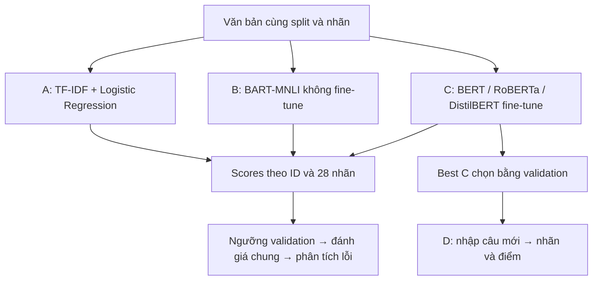

# Thứ tự đọc và triển khai toàn đồ án GoEmotions

Cập nhật **08/10/2026**. Dành cho nhóm 4 người: **Bảo Duy Nguyễn, Quốc Khánh,
Đức Trí, Nhật Huy**. Đọc theo đầu việc, không chia thời gian.

## 1. Hiểu bài toán trước khi đọc code

Đầu vào là bình luận **tiếng Anh**. Đầu ra là 28 điểm và tập nhãn đạt ngưỡng:
27 cảm xúc + `neutral`. Một câu có thể có nhiều cảm xúc đồng thời.

**A, B và C là ba hướng xử lý song song cùng dữ liệu. Đầu ra A không phải đầu vào C.**
C học trực tiếp từ văn bản và nhãn train; A cung cấp mốc kết quả để so sánh.
TF-IDF là đầu vào của Logistic Regression trong A, không phải đặc trưng cấp cho BERT.



Output hỗ trợ đọc phản hồi, nhóm bình luận theo cảm xúc và ưu tiên xem xét các trường
hợp cần hỗ trợ. Đây là hướng ứng dụng; F1 trên Reddit chưa chứng minh hiệu quả nghiệp vụ
hay chất lượng trên tiếng Việt. Giá trị công nghiệp cần kiểm trên dữ liệu đúng miền.
Case Study 4 của Jay Lee, *Industrial AI* (2020), mục 4.2.3.1, trang in 82–88,
được liên hệ trong **mục 5.6** [báo cáo](../reports/BAO_CAO_DO_AN_NOI_DUNG.md).
Đó là ví dụ năng lượng nhà máy, không phải kết quả thực nghiệm GoEmotions;
không dùng số ROI trong case này làm ROI hệ thống NLP.

## 2. Thứ tự đọc tài liệu và notebook

| Thứ tự | Tài liệu | Đọc để hiểu |
|---|---|---|
| 1 | [Kế hoạch nhóm](KE_HOACH_NHOM.md), [đối chiếu yêu cầu](DOI_CHIEU_YEU_CAU_CO.md) | Phân công, sản phẩm và điều kiện nghiệm thu |
| 2 | [GoEmotions ACL 2020](https://aclanthology.org/2020.acl-main.372/) — mục 3–5 | Nguồn dữ liệu, taxonomy, phân tích và BERT bài gốc |
| 3 | [EDA](../notebooks/eda.ipynb), rồi [EDA bổ sung](../notebooks/eda_extra.ipynb) | Split, phân bố nhãn, multi-label, nhãn hiếm và đồng xuất hiện |
| 4 | [Baseline](../notebooks/baseline.ipynb), [hướng dẫn A](BASELINE.md), [tính tay và câu hỏi bảo vệ](HUONG_DAN_DUY_GIAI_THICH_BASELINE.md) | Luồng A của Duy, cách giải thích code và các kết quả validation đã có |
| 5 | [Zero-shot](../notebooks/zero_shot.ipynb), [hướng dẫn B](ZERO_SHOT.md) | NLI, template, candidate labels và mapping |
| 6 | [Transformer](../notebooks/transformers.ipynb), [hướng dẫn C/D](TRANSFORMERS.md) | Tokenizer, BCE, seed, checkpoint và demo |
| 7 | [Phân tích lỗi](ERROR_ANALYSIS.md) | Ít nhất ba loại lỗi trên cùng ID giữa ba C |
| 8 | [Nội dung báo cáo](../reports/BAO_CAO_DO_AN_NOI_DUNG.md) | Cách trình bày dữ liệu, phương pháp, kết quả và hạn chế |

Notebook có hướng dẫn không đồng nghĩa đã đủ thực nghiệm. Khi cần số cuối, đọc
artifacts full và `reports/project_results/summary.json`; `missing` cho biết phần
chưa đủ bằng chứng. Các file ở `data/processed/` chỉ xuất hiện khi đã chạy hoặc nhận bàn giao.

## 3. Ai làm trọn phần nào?

| Người | Phần chính | Bàn giao |
|---|---|---|
| **Duy — Bảo Duy Nguyễn** | A; điều phối B làm chung | Hai baseline, ngưỡng, scores/metrics, nhãn hiếm; tiếp nhận và kiểm B |
| **Quốc Khánh** | C1 `google-bert/bert-base-cased`; phần đầu/tổng hợp báo cáo | BERT đủ ≥3 seed, cấu hình, checkpoint, bảng và phần viết |
| **Đức Trí — Thợ Săn Thập Cẩm** | C2 `FacebookAI/roberta-base`; hỗ trợ/bàn giao B đã nhận | RoBERTa đủ ≥3 seed, kết quả, lỗi và phần viết C2 |
| **Nhật Huy** | C3 `distilbert/distilbert-base-uncased`; demo D | DistilBERT đủ ≥3 seed; app dùng C thắng, dù C thắng thuộc bạn khác |

Mỗi người phụ trách C cần tự đọc, chạy, kiểm kết quả và giải thích kiến trúc của mình.
Script chung hỗ trợ thực hiện; không thay trách nhiệm sở hữu phần việc của ba bạn.

## 4. Duy cần học gì và đọc hàm nào?

| Chủ đề | Tự kiểm | Hàm/file nên đọc |
|---|---|---|
| Python/NumPy và multi-hot | Đổi `[0,2]` thành `[1,0,1]`; giải thích N×28 | `src/data.py`: `load_goemotions`, `multi_hot` |
| Train/val/test | Chỉ ra `.fit` dùng train, chọn ngưỡng dùng val | `scripts/run_baseline.py`: `build_model`, `main` |
| TF-IDF và unigram/bigram | Giải thích tại sao val không mở rộng từ vựng train | `build_model`: vectorizer trong Pipeline |
| Logistic Regression/OvR | Với scores `[0.8,0.3,0.7]` và ngưỡng 0,5, chọn hai nhãn | `build_model`, `predict_proba` |
| Precision/Recall/F1/Hamming | Tính TP/FP/FN một ví dụ; phân biệt macro/micro | `src/metrics.py`: `evaluate_multilabel` |
| Weighting và ngưỡng | Giải thích tăng Recall nhưng có thể tăng FP | `src/baseline.py`: `tune_thresholds`, `tune_global_threshold` |
| So sánh/lỗi/bàn giao | Đọc câu có ID, nhãn thật, thiếu/thừa và score | `scripts/analyze_baseline.py`, `label_error_pairs`, `export_baseline_results` |
| B điều phối chung | NLI entailment khác cảm xúc neutral; pipeline trả nhãn đã sắp xếp | `src/zero_shot.py`: `map_pipeline_scores`, `predict_in_batches` |

Đọc tiếp [thứ tự baseline riêng](THU_TU_DOC_BASELINE.md). Bắt đầu từ notebook rồi code;
không cần học toàn bộ PyTorch để giải thích A. Cần hiểu C ở mức so sánh ngữ cảnh,
fine-tuning và đa nhãn. Bảng A là validation/test riêng; Macro-F1 không phải tỷ lệ câu đúng.

## 5. Thứ tự chạy từ dữ liệu đến kết quả

Dùng môi trường Python đã được cài đúng dependencies của repo; xem
[hướng dẫn môi trường và thực nghiệm](CHAY_THUC_NGHIEM.md). Các lệnh dưới chạy
tại gốc kho mã. Nếu dùng môi trường cục bộ `.venv-models`, thay `python` bằng
`.\.venv-models\Scripts\python.exe`. Không cài lại hoặc huấn luyện lại chỉ để đọc bảng có sẵn.

### A. Dữ liệu và baseline

```powershell
python -m scripts.run_eda
python -m scripts.run_baseline
python -m scripts.run_baseline --variant balanced
python -m scripts.analyze_baseline
python -m scripts.export_baseline_results
```

Đọc `data/manifest.json`, `data/labels.json`, `reports/THONG_KE_DU_LIEU.md`,
`reports/BASELINE_RESULTS.md`. Với baseline đã bàn giao, kiểm hash/cấu hình trước khi dùng.

### B. Pretrained không fine-tune

```powershell
python -m scripts.run_zero_shot --smoke --device cuda --dtype float16 --batch-size 16
python -m scripts.run_zero_shot --device cuda --dtype float16 --batch-size 16
```

Full B cần đủ 5.426 câu validation × 28 nhãn. Ngưỡng @0,5 là mốc gốc; ngưỡng
chọn bằng nhãn val phải ghi là có hiệu chỉnh trên val dù trọng số không fine-tune.
Các lệnh B trên khớp run CUDA float16 của máy hiện tại. Máy CPU chạy thí nghiệm
riêng với `--device cpu --dtype float32 --batch-size 16`. Khi resume B, giữ nguyên
device/dtype/batch-size/môi trường và model SHA; không chuyển run GPU sang CPU.

### C. Fine-tune và chọn kiến trúc

```powershell
python -m scripts.train_transformer --architecture bert --seed 42 --smoke --device cuda
python -m scripts.run_transformer_seeds --seeds 42 123 2026 --device cuda --resume
python -m scripts.select_best_transformer --seeds 42 123 2026
```

Ba kiến trúc khác nhau, mỗi kiến trúc ít nhất ba seed; kế hoạch chính gồm 9 run.
`--resume` chỉ bỏ qua run đã hoàn tất đúng config/hash. Run bị ngắt giữa epoch cần
chạy lại riêng với `--overwrite`, không bỏ vào bảng chính như run hoàn tất.
Config C hiện tại: batch **16**, accumulation **1**, max length **128**;
`dynamic_batch_trim` chỉ bỏ padding dư. Lệnh `--device cuda` giữ đúng config các
run GPU đang có; máy CPU bắt đầu run riêng với `--device cpu`. Run complete chỉ
được resume khi config khớp, kể cả lựa chọn device đã khai báo.

Để điều phối toàn bộ thay cho gọi riêng từng script:

```powershell
python -m scripts.complete_project --device cuda
# Sau khi xác định cần chạy lại run dở:
python -m scripts.complete_project --device cuda --restart-incomplete
```

Không chạy đồng thời pipeline và các lệnh train/predict khác trên cùng GPU.

### D. Khóa trước test, rồi tổng hợp và phân tích lỗi

```powershell
python -m scripts.freeze_baseline
python -m scripts.evaluate_baseline_test
python -m scripts.freeze_experiment --run-dir data/processed/zero_shot/full
python -m scripts.run_zero_shot --split test --device cuda --dtype float16 --batch-size 16 --protocol data/processed/zero_shot/full/final_protocol.json
```

Với **từng run C full**, chạy hai lệnh sau, thay đường dẫn cho đúng kiến trúc/seed:

```powershell
python -m scripts.freeze_experiment --run-dir data/processed/transformers/bert/seed_42/full/standard
python -m scripts.evaluate_transformer_test --run-dir data/processed/transformers/bert/seed_42/full/standard --device auto
```

Protocol đã tồn tại thì giữ nguyên; không khóa lại để chọn theo test.

```powershell
python -m scripts.summarize_project --require-complete
python -m scripts.analyze_project_errors --split test --threshold-mode fixed
```

Đọc bảng seed và mean±sample std; đọc `examples.csv` rồi bổ sung giải thích ngôn ngữ
thủ công. Nhãn đồng xuất hiện trong EDA không phải cặp dự đoán nhầm FN/FP.

### E. Demo và báo cáo

Chỉ chạy sau khi C full và lựa chọn demo đã hoàn tất:

```powershell
python -m scripts.verify_demo --device cuda
python app.py --device auto
```

`reports/demo_verification.json` ghi đối chiếu ba câu validation và các trường
hợp nhập rỗng/quá dài/cắt token. Kiểm suy luận dùng ngưỡng 0,5 và không chọn lại
mô hình; việc app/HTTP chạy và ảnh giao diện cần minh chứng riêng. Không dùng chữ
PASS suy luận để kết luận đã kiểm giao diện.

Demo phải dùng checkpoint C full được chọn. Nếu dùng ngưỡng tuned, truyền
`--thresholds` là `final_protocol.json` của **chính run được chọn**. Đọc run được
chọn trong `selected_model.json`, không mặc định BERT hoặc DistilBERT thắng.

Tổng hợp số thực nghiệm vào báo cáo, kèm nguồn IEEE `[n]`, cấu hình khác bài gốc,
≥3 loại lỗi, nâng cao/F1 nhãn hiếm, hạn chế, đóng góp thực tế và minh chứng demo.
Các mẫu hành chính chưa biết như MSSV/lớp/giảng viên phải do nhóm điền đúng.
Khi bàn giao GitHub, đọc bản metadata nhỏ/cấu hình/SHA/protocol ở
`reports/reproducibility/` nếu đã được xuất. Checkpoint/scores nguồn nằm trong
`data/processed/` và không tự xuất hiện chỉ vì đã clone repo; bản metadata giúp
đối chiếu lần chạy, không thay thế mô hình để mở demo.

## 6. Cách biết nhóm đã đủ yêu cầu

- B/C notebooks chỉ đọc trạng thái/kết quả local và in lệnh; chạy các ô không
  tự train hay mở test. C incomplete hiện số epoch đã log; chỉ C complete có
  metric cuối sau kiểm hash. B incomplete hiện số batch/mẫu đã ghi. JSON/hash
  hỏng báo lỗi, không bị che thành “đang làm”. Chạy lại các ô trạng thái để cập nhật.
- Code và unit tests chứng minh logic; **cần log full** để chứng minh kết quả A/B/C.
- C cần đủ 9 run, bảng từng seed và mean±sample std; không lấy smoke hoặc một seed thay bảng này.
- Nâng cao dùng weighting **hoặc** ngưỡng riêng **hoặc** contrastive; cần số trước/sau
  và F1 nhãn hiếm, không bắt buộc làm cả ba.
- `--require-complete` kiểm dữ liệu thực nghiệm; nhóm còn tự kiểm phần đọc paper,
  giải thích lỗi, app đang chạy, hai báo cáo tiến độ và đóng góp/bảo vệ.
- Checklist bằng chứng chi tiết: [DOI_CHIEU_YEU_CAU_CO.md](DOI_CHIEU_YEU_CAU_CO.md).
