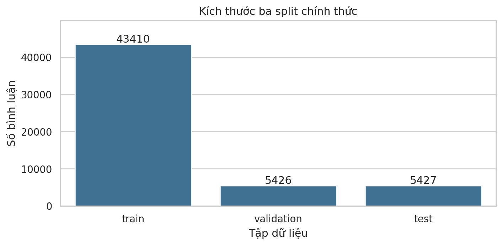
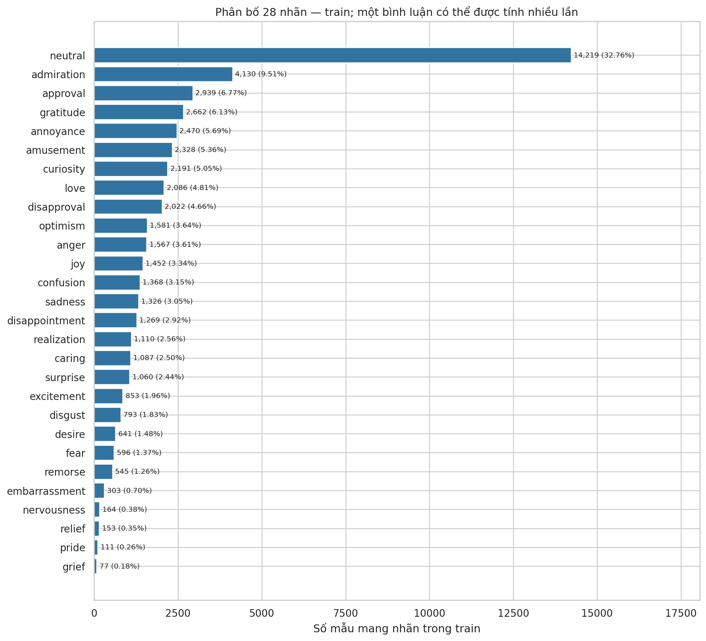
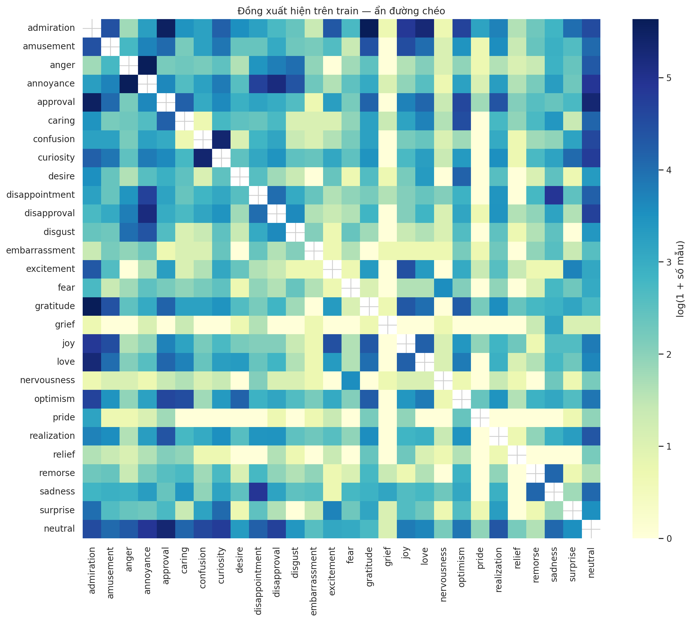

# BÁO CÁO ĐỒ ÁN MÔN XỬ LÝ NGÔN NGỮ TỰ NHIÊN

## Phân loại cảm xúc đa nhãn trên văn bản mạng xã hội với GoEmotions

**Trường:** Trường Đại học Ngoại ngữ – Tin học Thành phố Hồ Chí Minh.

**Khoa:** Công nghệ Thông tin.

**Giảng viên hướng dẫn:** ____________________

**Mã lớp học phần:** ____________________

**Năm học / học kỳ:** ____________________

**Thành viên:** Bảo Duy Nguyễn, Quốc Khánh, Đức Trí, Nhật Huy.

**Mã số sinh viên:** ____________________

**Ngày cập nhật nội dung:** 08/10/2026.

**Kho mã nguồn chung:** https://github.com/trangkhanh-ai/goemotions-multilabel-classification

**Kế hoạch nhóm trên Notion:** https://app.notion.com/p/3ed7c27769028185af2dfbaac4c4586b

## Lời cảm ơn

Nhóm xin cảm ơn giảng viên đã hướng dẫn xác định bài toán, yêu cầu thực nghiệm và cách trình bày kết quả. Nhóm cảm ơn các tác giả GoEmotions cùng các cộng đồng mã nguồn mở đã công bố dữ liệu, mô hình và công cụ phục vụ học tập. Các thành viên chịu trách nhiệm kiểm tra số liệu, giải thích phương pháp và ghi nhận những giới hạn của sản phẩm trong báo cáo này.

## Tóm tắt

Đề tài xây dựng hệ thống phân loại nhiều cảm xúc đồng thời cho một bình luận tiếng Anh. Nghiên cứu dựa trên bài GoEmotions của Demszky và cs.; tập nhãn gồm 27 cảm xúc cùng neutral [1]. Thiết kế so sánh gồm A: TF-IDF kết hợp One-vs-Rest Logistic Regression; B: mô hình BART-MNLI dùng trực tiếp cho zero-shot; C: fine-tune ba kiến trúc BERT, RoBERTa và DistilBERT; D: giao diện từ mô hình C được chọn trên validation. Nhóm dùng bộ chia chính thức, giữ thứ tự 28 nhãn và đánh giá bằng Macro-F1, Micro-F1, Precision, Recall, Hamming Loss cùng kết quả từng nhãn.

Phần A đã được đo trên toàn bộ 5.426 mẫu validation. Phiên bản thường với ngưỡng 0,5 đạt Macro-F1 0,2025 và Micro-F1 0,3760; phiên bản dùng trọng số cân bằng kết hợp ngưỡng riêng đạt lần lượt 0,4901 và 0,5467. Điểm của cấu hình chọn ngưỡng được đo trên chính validation dùng để lựa chọn, vì vậy chưa phải bằng chứng đánh giá độc lập trên test. Báo cáo phân tích mất cân bằng, nhãn hiếm, sai sót đa nhãn và quan hệ giữa kết quả dự đoán với quyết định nghiệp vụ. Các kết quả B/C/D chỉ được bổ sung từ tệp chạy thật; không suy ra kết quả thực nghiệm từ việc có mã nguồn.

**Từ khóa:** natural language processing, GoEmotions, multi-label classification, TF-IDF, Logistic Regression, BERT, threshold tuning.

## Mục lục và danh mục

Mục lục, danh mục hình và danh mục bảng của bản Word được tạo từ các tiêu đề/chú thích. Nhóm cập nhật trường tự động trong Word sau khi bổ sung kết quả cuối. Bố cục báo cáo theo mẫu gồm sáu chương, tài liệu tham khảo, phụ lục mã nguồn và phụ lục phân công. Thông tin hành chính chưa được xác nhận để trống.

# CHƯƠNG 1. GIỚI THIỆU

## 1.1. Đặt vấn đề

Một bình luận có thể đồng thời thể hiện sự biết ơn và ngưỡng mộ; một phản hồi khác có thể vừa thất vọng vừa tức giận. Nếu chỉ gán một nhãn tích cực, tiêu cực hoặc trung tính, hệ thống khó thể hiện những sắc thái này. Đề tài đặt bài toán: nhận một đoạn văn bản và dự đoán một tập nhãn cảm xúc, đồng thời cung cấp điểm số để giải thích luật lựa chọn.

Trong một quy trình tiếp nhận phản hồi khách hàng, nhân viên vẫn phải hiểu nhu cầu thực tế và quyết định cách xử lý. Mô hình cảm xúc có thể giúp sắp xếp phản hồi cần đọc trước, thống kê nhóm phản hồi theo thời gian hoặc đưa ra gợi ý giọng điệu trả lời. Đầu ra của mô hình là thông tin hỗ trợ; nhãn anger không tự xác định khách hàng đang gặp lỗi sản phẩm, và nhãn sadness không tự xác định một tình trạng sức khỏe.

Nhóm chọn GoEmotions vì dữ liệu có hệ nhãn chi tiết và bộ chia phục vụ so sánh. Bản thô chứa 58.009 bình luận; bản đã lọc cho huấn luyện được chia thành 43.410 train, 5.426 validation và 5.427 test [2]. Nhóm sử dụng cấu hình simplified trên Hugging Face để tải ba split và giữ cấu trúc id, text, labels [3]. Vấn đề kỹ thuật nổi bật là số lượng mẫu dương giữa các nhãn chênh lệch lớn, đầu ra thưa và nhiều câu cần ngữ cảnh bên ngoài.

## 1.2. Mục tiêu của đề tài

Mục tiêu tổng quát là xây dựng một quy trình có thể chạy lại, giải thích được từng bước và so sánh các hướng phân loại đa nhãn theo cùng quy tắc. Các mục tiêu cụ thể gồm:

1. Đọc bài nền tảng, giải thích nguồn dữ liệu, taxonomy và đặc điểm đa nhãn.
2. Khảo sát số lượng mẫu, phân bố nhãn, số nhãn mỗi câu, độ dài và chất lượng dữ liệu.
3. Xây dựng baseline A bằng TF-IDF và Logistic Regression để có mốc so sánh đơn giản.
4. Triển khai B từ mô hình pretrained trực tiếp, không cập nhật trọng số trên GoEmotions.
5. Fine-tune ba kiến trúc C; mỗi kiến trúc có ít nhất ba seed và báo cáo trung bình cùng độ lệch chuẩn.
6. Đo toàn bộ chỉ số cô yêu cầu; đọc ít nhất ba loại lỗi có ví dụ cụ thể đối chiếu giữa các C.
7. Thực hiện nâng cao bằng weighting và/hoặc ngưỡng riêng; báo F1 nhãn hiếm trước và sau.
8. Tích hợp demo D bằng checkpoint của C thắng theo quy tắc validation đã khai báo.
9. Bàn giao mã, hướng dẫn, cấu hình, scores, bảng kết quả và đóng góp thực tế của bốn thành viên.

Thành công của đề tài được đánh giá bằng sự đầy đủ của bằng chứng thực nghiệm, chất lượng phương pháp và khả năng giải thích. Nhóm không đặt một con số F1 dự kiến thành kết quả đã đạt, cũng không bảo đảm một mô hình cụ thể sẽ đứng đầu trước khi đo.

## 1.3. Phạm vi nghiên cứu

Đầu vào chính là bình luận tiếng Anh trong GoEmotions. Đầu ra có 28 cột: 27 cảm xúc và neutral. Benchmark chính giữ toàn bộ split chính thức, dùng annotation gốc và không gộp thành bảy nhãn Ekman. Nhóm khảo sát các trường hợp trùng văn bản để giải thích giới hạn, nhưng không âm thầm thay bộ chia.

TF-IDF và các mô hình pretrained có cách tạo đặc trưng riêng; điều kiện so sánh chung là split, label mapping, metric và quy tắc lựa chọn. Phần C dùng head đa nhãn, loss nhị phân theo từng cột và sigmoid ở bước xuất điểm. Nhóm không huấn luyện lại các encoder từ đầu trên kho văn bản lớn.

Demo minh họa việc nhập văn bản và xem nhãn/điểm. Một hệ thống doanh nghiệp cần thêm dữ liệu đúng miền, đánh giá nghiệp vụ, phân quyền, quản lý phản hồi và theo dõi sau triển khai. Những việc đó được thảo luận như hướng ứng dụng, không được ghi nhận là sản phẩm đã triển khai trong công nghiệp.

## 1.4. Cấu trúc báo cáo

Chương 1 xác định bài toán và phạm vi. Chương 2 trình bày nền tảng toán học, mô hình và cách đo. Chương 3 mô tả nguồn, EDA và quy tắc dữ liệu. Chương 4 giải thích cách cài đặt, luồng huấn luyện và ví dụ từng bước. Chương 5 tập hợp kết quả thật, phân tích sai sót và giá trị ứng dụng. Chương 6 nêu kết quả đạt được, hạn chế và hướng phát triển. Phụ lục cung cấp sơ đồ mã nguồn, thứ tự chạy và phân công nhóm.

## 1.5. Căn cứ yêu cầu và cách trích dẫn

Bảng đề tài cô cung cấp chỉ định bài GoEmotions ACL 2020 làm nền tảng. Báo cáo giữ bài này; các tài liệu kiến trúc và thư viện được dùng để giải thích những phần triển khai bổ sung. Cấu hình nhóm khác bài gốc phải được khai báo. TF-IDF + Logistic Regression là baseline cổ điển trong yêu cầu môn học; baseline chính của bài GoEmotions là BERT.

Mẫu báo cáo tham khảo có tiêu đề học phần Học máy và thông tin giảng viên/lớp mẫu. Nhóm chỉ sử dụng bố cục sáu chương và quy tắc trình bày; tên học phần và thông tin hành chính được điều chỉnh cho môn NLP. Chuẩn IEEE được áp dụng cho trích dẫn số [n], danh mục nguồn tiếng Anh, tác giả, năm, DOI và URL [4]. Báo cáo học phần theo chương không bị ép thành bố cục hai cột của một bài hội nghị.

**Bảng 1-1. Đối chiếu yêu cầu môn học và bằng chứng cần có.**

| Yêu cầu | Phương án trong đề tài | Bằng chứng nghiệm thu |
|---|---|---|
| Dữ liệu và paper | GoEmotions, 28 nhãn, official split | Nguồn, manifest, EDA, tóm tắt bằng lời nhóm |
| A do một người | Duy làm TF-IDF + OvR LR | Mã, model, scores, cấu hình, kết quả |
| B dùng pretrained trực tiếp | BART-large-MNLI, không fine-tune | Template, revision, mapping, scores |
| Ba C do ba người | Khánh BERT; Trí RoBERTa; Huy DistilBERT | Từng run, ít nhất ba seed/kiến trúc |
| Mean ± std | Cùng cấu hình giữa các seed | Bảng từng seed và sample std |
| Demo D | C được chọn theo validation | App chạy được, checkpoint, ngưỡng đúng |
| Nâng cao | Weighting, ngưỡng riêng | Trước/sau, nhãn hiếm, đánh đổi P/R |
| Phân tích lỗi | Ít nhất ba nhóm, đối chiếu C | Cùng ID, true/pred và lý do |
| Báo cáo, đóng góp | Hai tiến độ, báo cáo cuối | Nội dung, minh chứng và tỷ lệ nhóm xác nhận |

# CHƯƠNG 2. CƠ SỞ LÝ THUYẾT

## 2.1. Học máy và xử lý ngôn ngữ trong đề tài

Một mô hình học máy học quan hệ từ dữ liệu huấn luyện để xử lý mẫu chưa được dùng khi học. Trong đề tài này, mỗi mẫu huấn luyện gồm câu x và vector nhãn y. Việc huấn luyện tìm tham số để đầu ra gần y hơn; việc suy luận dùng các tham số đã lưu để xử lý câu mới. Nhãn thật chỉ dùng để huấn luyện hoặc đo đánh giá, không được đưa vào mô hình khi dự đoán mẫu mới.

NLP là phần chuyển văn bản thành biểu diễn số và học quan hệ ngôn ngữ. A dùng từ/cặp từ; C dùng token con cùng biểu diễn ngữ cảnh đã được pretrained. B chuyển nhãn thành một giả thuyết ngôn ngữ để mô hình NLI kiểm tra. Những khác biệt này là cơ sở để phân tích chi phí, khả năng học ngữ cảnh và lỗi của các hướng.

Hai giai đoạn cần tách là huấn luyện và suy luận. Huấn luyện A/C có dùng train và cập nhật tham số. Suy luận A/B/C chỉ cần văn bản cùng artifacts đã chốt. Chọn threshold là bước quyết định sau điểm dự đoán; ngưỡng thay đổi tập nhãn được trả ra, nhưng không tự làm encoder hoặc hệ số LR học thêm.

## 2.2. Định nghĩa bài toán đa nhãn

Với L = 28, một nhãn thật là y ∈ {0,1}^L. Thành phần y_j = 1 nghĩa là bình luận có nhãn j. Mô hình trả s(x) ∈ [0,1]^L. Luật quyết định với ngưỡng t_j là:

**ŷ_j = 1 nếu s_j(x) ≥ t_j; ngược lại ŷ_j = 0.**

Trong phân lớp một nhãn, các lớp thường loại trừ nhau và ta lấy argmax. Với đa nhãn, mỗi cột được quyết định riêng. Tổng điểm 28 nhãn không cần bằng một; tập kết quả có thể chứa nhiều nhãn hoặc không chứa nhãn nào. Nhóm giữ neutral như một nhãn được annotation, không tự thêm neutral khi mọi điểm thấp hơn ngưỡng.

Ví dụ minh họa: nhãn chuẩn theo thứ tự [gratitude, admiration, sadness] và câu “Thank you, your work is amazing” có vector [1,1,0]. Đây là vector multi-hot, khác one-hot [1,0,0]. Ví dụ chỉ nhằm giải thích biểu diễn, không được tính thành dữ liệu thực nghiệm của nhóm.

## 2.3. TF-IDF và Logistic Regression

### 2.3.1. TF-IDF

TF-IDF biểu diễn câu bằng trọng số của những từ/cặp từ xuất hiện. Trong triển khai A, `TfidfVectorizer` học vocabulary và document frequency từ train, sau đó biến đổi validation bằng các giá trị đã học [5]. Nhóm sử dụng unigram và bigram, `min_df=2`, `max_features=100000`; vocabulary thực tế sau fit có 58.338 đặc trưng.

Với N văn bản train, tf(t,d) là số lần đặc trưng t xuất hiện ở văn bản d và df(t) là số văn bản chứa t. Khi dùng smooth_idf của cấu hình hiện tại:

**idf(t) = ln((1 + N)/(1 + df(t))) + 1.**

Trọng số chưa chuẩn hóa bằng tf(t,d) × idf(t). Vector cuối được chuẩn hóa L2: chia mỗi thành phần cho căn tổng bình phương các thành phần. Một từ xuất hiện trong nhiều câu thường có idf thấp hơn từ hiếm; điều này không tự chứng minh từ hiếm có ý nghĩa cảm xúc. Bigram giúp giữ một phần trật tự, như “not happy”, nhưng không mô tả toàn bộ ngữ cảnh dài.

### 2.3.2. Logistic Regression

Đối với một nhãn j, LR tính z_j = w_j^T x + b_j rồi p_j = sigmoid(z_j) = 1/(1 + exp(−z_j)). Hệ số w_j cho biết đặc trưng đóng góp dương hay âm vào logit của nhãn đó. LR học tham số bằng cách tối thiểu hóa loss cùng regularization; tham số C điều khiển mức regularization, không phải số cảm xúc [6].

Về trực giác, khi dự đoán nhãn thật dương mà p_j gần 0, loss lớn; khi dự đoán gần nhãn thật, loss nhỏ hơn. Một dạng loss nhị phân là −[y_j ln p_j + (1−y_j) ln(1−p_j)]. L2 regularization hạn chế hệ số quá lớn. Biểu thức toán ở đây giải thích nguyên lý; chi tiết tối ưu thực tế do solver `liblinear` thực hiện.

### 2.3.3. One-vs-Rest

OvR biến ma trận multi-hot thành 28 bài toán nhị phân. Bộ thứ nhất học “có admiration/không có admiration”, bộ thứ hai học “có amusement/không có amusement”, và tương tự cho các nhãn còn lại. Khi y có dạng indicator đa nhãn, `OneVsRestClassifier` hỗ trợ cách huấn luyện này [7]. Các bộ phân loại dùng chung ma trận TF-IDF nhưng có hệ số riêng.

Cấu trúc này dễ đọc, chạy nhanh trên CPU và tạo scores N×28. Một hạn chế là từng bộ không mô hình hóa trực tiếp quan hệ giữa các nhãn. Nhóm vẫn đo đồng xuất hiện và lỗi bỏ sót/thừa để hiểu những hạn chế đó. Hệ số cao của “thanks” đối với gratitude là liên hệ thống kê; nó không cho phép kết luận nguyên nhân tâm lý của người viết.

## 2.4. Transformer và ba kiến trúc C

BERT học biểu diễn ngôn ngữ bằng ngữ cảnh hai phía, sau đó có thể fine-tune cho tác vụ với một tầng đầu ra [8]. Trong đề tài, C1 nạp encoder BERT-base và head 28 logit. Head được điều chỉnh cho GoEmotions; tokenizer phải tương ứng checkpoint. Nhóm chọn bản cased để phù hợp lựa chọn công bố trong kho GoEmotions.

RoBERTa nghiên cứu những điều chỉnh của quy trình pretraining BERT, gồm dữ liệu và siêu tham số, để tạo mô hình ngôn ngữ mạnh hơn [9]. C2 dùng RoBERTa-base với tokenizer riêng. Chất lượng được công bố trên các benchmark của bài RoBERTa không phải kết quả GoEmotions nhóm đã đo; thứ hạng C2 chỉ được xác định sau thực nghiệm.

DistilBERT dùng knowledge distillation để tạo encoder nhỏ hơn từ BERT [10]. C3 dùng DistilBERT-base-uncased để khảo sát sự đánh đổi giữa hiệu quả phân loại và tài nguyên. Tốc độ phụ thuộc máy, batch, chiều dài và cách suy luận; nhóm đo thời gian của chính run thay vì coi số liệu của paper là thời gian demo trên máy nhóm.

Luồng chung là văn bản → tokenizer → input_ids/attention_mask → encoder → head → logits. Tokenizer có thể tách một từ thành nhiều token con. Attention mask phân biệt token thật với padding. Logit là số thực trước sigmoid; nó chưa phải xác suất. Ba encoder khác nhau nhưng đầu ra của hệ thống phải cùng thứ tự nhãn chuẩn để so sánh.

## 2.5. Zero-shot B và suy luận ngôn ngữ tự nhiên

Yin và cs. dùng entailment như một hướng để phân loại văn bản không cần dữ liệu huấn luyện riêng cho các nhãn đích [11]. NLI xem quan hệ giữa premise và hypothesis: entailment, contradiction hoặc neutral. Cách áp dụng của nhóm dùng premise là bình luận và hypothesis như “This text expresses gratitude.”

BART là mô hình pretrained encoder–decoder có thể thích nghi cho nhiều tác vụ [12]. Checkpoint `facebook/bart-large-mnli` đã được fine-tune trên MNLI trước khi nhóm sử dụng [13]. Nhóm dùng pipeline zero-shot với đủ 28 candidate labels, template đã chốt và `multi_label=True` [14]. B không cập nhật trọng số bằng train GoEmotions.

Điểm của từng nhãn được xử lý theo cặp entailment/contradiction; nhãn NLI neutral khác nhãn cảm xúc neutral. Pipeline thường trả nhãn theo score giảm dần, nên code phải ánh xạ lại thứ tự `data/labels.json`. Nếu dùng validation để chọn ngưỡng, B vẫn không fine-tune trọng số, nhưng đã dùng nhãn đích để hiệu chỉnh luật quyết định. Báo cáo tách kết quả gốc @0,5 và kết quả đã hiệu chỉnh.

## 2.6. Loss nhị phân và mất cân bằng

Phần C dùng binary cross entropy cho từng logit; các nhãn không cạnh tranh qua softmax. `BCEWithLogitsLoss` kết hợp sigmoid và BCE trong một bước ổn định số; dữ liệu nhãn có dạng float multi-hot [15]. Khi tính loss, code truyền logits trực tiếp; sigmoid chỉ áp dụng để xuất scores cho đánh giá/suy luận.

Đối với nhãn j, có n_j mẫu dương và N−n_j mẫu âm. Nếu n_j rất nhỏ, việc đoán âm nhiều lần có thể giảm loss nhưng recall nhãn j thấp. Trong A balanced, mỗi bộ LR tính trọng số của hai lớp từ train: w_+ = N/(2n_j), w_- = N/(2(N−n_j)). C có thể dùng pos_weight_j = (N−n_j)/n_j nếu chọn thí nghiệm weighting. Hai API có cách đưa trọng số vào loss khác nhau, nên không mô tả chúng như cùng một hàm.

Weighting thay đổi cách học và cần train lại; threshold tuning thay đổi cách quyết định trên scores đã có. Các trọng số nhãn hiếm có thể rất lớn, làm tăng false positive hoặc tạo dao động. Do đó hiệu quả phải được đánh giá cùng Precision/Recall, support và Hamming Loss; tăng recall riêng không chứng minh toàn bộ hệ thống tốt hơn.

## 2.7. Các thước đo đánh giá

Với một nhãn j, TP là dự đoán dương đúng; FP là dự đoán dương thừa; FN là bỏ sót nhãn thật. Precision_j = TP/(TP+FP); Recall_j = TP/(TP+FN); F1_j = 2TP/(2TP+FP+FN). Nhóm dùng `zero_division=0`, giữ đủ 28 nhãn và xuất support để biết cơ sở của từng điểm [16].

**Micro-F1** cộng TP, FP và FN trên toàn bộ mẫu và nhãn rồi tính F1. **Macro-F1** tính F1 từng nhãn và lấy trung bình 28 giá trị. Macro khiến mỗi nhãn có trọng số như nhau, nên phù hợp khi chú ý nhãn hiếm. Macro-F1 không bằng F1 tính từ Macro-Precision và Macro-Recall. F1 = 0,49 cũng không có nghĩa 49% câu có tập nhãn hoàn toàn đúng.

**Hamming Loss = số quyết định nhãn sai/(N×28).** Hamming đo sai từng ô, khác việc cả tập nhãn của một câu có khớp hoàn toàn hay không [17]. Vì phần lớn ô là 0, một hệ thống đoán rất ít nhãn có thể có Hamming thấp nhưng recall kém. Với density train khoảng 0,042, việc luôn đoán âm cho mọi nhãn đã có tỷ lệ sai ô khá thấp mà không tìm được cảm xúc nào. Bởi vậy Hamming phải được đọc cùng F1 và P/R.

Với K seed của một kiến trúc, trung bình m̄ = (Σm_k)/K và sample std s = √(Σ(m_k−m̄)²/(K−1)). Triển khai dùng `np.std(values, ddof=1)` và ghi K [18]. Std này mô tả biến động giữa các run đã đo; nó không phải sai số từng nhãn hay khoảng tin cậy. Ba seed là mức tối thiểu cho bài môn học, không thay thế kiểm định thống kê đầy đủ.

## 2.8. Threshold tuning và nghiên cứu liên quan

Ngưỡng 0,5 là luật mặc định nhưng không luôn tối ưu F1, đặc biệt khi scores bị ảnh hưởng bởi mất cân bằng. Việc chọn threshold phải dùng dữ liệu validation và tránh tối ưu trên test [19]. Nhóm khảo sát ngưỡng chung tối đa Macro-F1 và ngưỡng riêng tối đa F1 từng nhãn trên lưới 0,05–0,95, bước 0,05.

Bài GoEmotions cung cấp taxonomy, phân tích và mốc BERT. BERT, RoBERTa, DistilBERT giải thích kiến trúc C; NLI/BART giải thích B. Tài liệu thư viện mô tả API triển khai. Bài gốc dùng BERT-base, batch 16, learning rate 5e−5 và ít nhất bốn epoch cho thí nghiệm chính; nhóm ghi các thay đổi nếu cấu hình C khác. Việc mở rộng thêm A/B/C và seed là để đáp ứng yêu cầu môn học, không phải tuyên bố tái hiện mọi thực nghiệm chuyển giao trong paper.

Ngưỡng chọn trên validation cùng được đánh giá trên validation có thể làm điểm lạc quan. Một kết luận cải tiến cần đánh giá bằng test sau khóa cấu hình. Vì mỗi nhãn hiếm có rất ít mẫu validation, t_j tìm được cũng có thể không ổn định; báo cáo giữ cả những nhãn chưa tăng F1.

# CHƯƠNG 3. CHUẨN BỊ DỮ LIỆU

## 3.1. Giới thiệu dữ liệu và khả năng truy xuất

Mỗi dòng simplified có ba trường: `id` là mã bình luận, `text` là văn bản và `labels` là danh sách ID nhãn. Nhóm ghim revision `add492243ff905527e67aeb8b80c082af02207c3`. Manifest và hash giúp phát hiện việc lẫn phiên bản hoặc thay tệp trong quá trình chạy. Số liệu EDA dưới đây tính từ các tệp tại revision này; không lấy từ một bài thực nghiệm khác.

**Bảng 3-1. Số mẫu các split.**

| Split | Số mẫu | Vai trò |
|---|---:|---|
| Train | 43.410 | Học vocabulary/IDF, weighting và tham số A/C |
| Validation | 5.426 | Chọn cấu hình, checkpoint, ngưỡng; theo dõi pilot |
| Test | 5.427 | Đánh giá cuối sau khi khóa các lựa chọn |
| Tổng | 54.263 | Benchmark simplified của nhóm |



**Hình 3.1. Kích thước bộ chia chính thức; số liệu từ EDA của nhóm.**

Label mapping là một phần của model artifacts. Nếu đảo cột anger và joy, hình dạng N×28 vẫn đúng nhưng mọi phép đánh giá theo tên bị sai. Nhóm giữ một danh sách chuẩn, kiểm danh sách này khi đọc scores và lưu cùng checkpoint. Tên tiếng Việt chỉ giúp trình bày, không thay tên nhãn tiếng Anh trong ma trận.

**Bảng 3-2. Thứ tự nhãn và support train.**

| ID | Nhãn | Diễn giải tiếng Việt | Train + |
|---:|---|---|---:|
| 0 | admiration | Ngưỡng mộ | 4.130 |
| 1 | amusement | Thích thú | 2.328 |
| 2 | anger | Tức giận | 1.567 |
| 3 | annoyance | Khó chịu | 2.470 |
| 4 | approval | Tán thành | 2.939 |
| 5 | caring | Quan tâm | 1.087 |
| 6 | confusion | Bối rối | 1.368 |
| 7 | curiosity | Tò mò | 2.191 |
| 8 | desire | Mong muốn | 641 |
| 9 | disappointment | Thất vọng | 1.269 |
| 10 | disapproval | Không tán thành | 2.022 |
| 11 | disgust | Ghê tởm | 793 |
| 12 | embarrassment | Ngượng ngùng | 303 |
| 13 | excitement | Hào hứng | 853 |
| 14 | fear | Sợ hãi | 596 |
| 15 | gratitude | Biết ơn | 2.662 |
| 16 | grief | Đau buồn sâu sắc | 77 |
| 17 | joy | Vui vẻ | 1.452 |
| 18 | love | Yêu thương | 2.086 |
| 19 | nervousness | Lo lắng, hồi hộp | 164 |
| 20 | optimism | Lạc quan | 1.581 |
| 21 | pride | Tự hào | 111 |
| 22 | realization | Nhận ra | 1.110 |
| 23 | relief | Nhẹ nhõm | 153 |
| 24 | remorse | Hối hận | 545 |
| 25 | sadness | Buồn bã | 1.326 |
| 26 | surprise | Ngạc nhiên | 1.060 |
| 27 | neutral | Trung tính | 14.219 |

## 3.2. Khám phá dữ liệu

### 3.2.1. Mất cân bằng và nhãn hiếm

Support đếm số câu chứa nhãn, không phải số câu chỉ chứa nhãn đó. Neutral xuất hiện trong 32,755% câu train; grief chỉ có 77 mẫu, tương đương 0,177%. Tỷ số nhãn phổ biến nhất/hiếm nhất là khoảng 184,66. Ngay khi bỏ neutral khỏi phép mô tả này, admiration/grief vẫn chênh khoảng 53,64 lần.

Danh sách nhãn hiếm được xác định trước từ train: grief, pride, relief, nervousness và embarrassment. Quy tắc này tránh chọn một vài nhãn sau khi nhìn kết quả để làm cải tiến có vẻ tốt. Nhóm báo đủ năm nhãn cùng support và giữ kết quả không tăng hoặc giảm. Các nhãn có 13–35 mẫu validation không đủ để diễn giải một thay đổi nhỏ như một bảo đảm tổng quát.



**Hình 3.2. Phân bố nhãn train; cùng một câu có thể đóng góp nhiều nhãn.**

### 3.2.2. Số nhãn và đồng xuất hiện

Train có 51.103 lượt gán nhãn, tức trung bình 1,17722 nhãn/câu. Có 7.102 câu train mang ít nhất hai nhãn, chiếm 16,3603%; 6.541 câu có hai nhãn và 561 câu có ít nhất ba nhãn. Đây là bằng chứng không nên biến bài toán thành phân lớp một nhãn. Tỷ lệ tương ứng của validation là 16,1813%.

Trong train, neutral có 1.396 câu xuất hiện cùng ít nhất một cảm xúc khác. Dữ liệu như vậy được giữ nguyên; quy tắc hậu xử lý xóa neutral khi có cảm xúc khác sẽ làm thay annotation và cần một thí nghiệm riêng nếu muốn khảo sát. Code benchmark chính không thêm quy tắc đó.

Các cặp đồng xuất hiện đáng chú ý trên train gồm admiration–gratitude 279 câu, anger–annoyance 269 câu, admiration–approval 246 câu, confusion–curiosity 212 câu. Đồng xuất hiện nói rằng hai nhãn được gán cùng nhau; nó không phải số lần model nhầm nhãn này thành nhãn kia.



**Hình 3.3. Đồng xuất hiện annotation train, khác bảng cặp FN/FP ở phần lỗi.**

### 3.2.3. Chất lượng, văn bản trùng và độ dài

EDA không tìm thấy id thiếu, text rỗng, tập nhãn rỗng, nhãn ngoài miền hoặc ID trùng giữa các split. Tuy nhiên, có văn bản trùng nguyên văn: train–validation có 41 chuỗi chung và train–test có 32 chuỗi chung. Các chuỗi chung train–test ảnh hưởng 37 dòng test. Một chuỗi có thể xuất hiện ở nhiều ID và có annotation khác nhau.

Benchmark chính giữ 5.427 mẫu test. Tệp phân tích độ nhạy liệt kê 5.390 ID test không trùng text nguyên văn với train; đây là phân tích phụ nếu nhóm báo thêm. Danh sách đó chưa loại các trường hợp trùng với validation, gần nghĩa hoặc chung cuộc hội thoại. Nhóm không suy ra rằng toàn bộ dữ liệu độc lập về người viết từ ba trường simplified.

Độ dài trung bình train khoảng 68,4 ký tự và 12,84 đơn vị cách nhau bởi khoảng trắng. Ký tự, từ theo khoảng trắng và token con là ba phép đo khác nhau. Tokenizer khác nhau có thể cho độ dài khác nhau. EDA tokenizer đã thực hiện trước đây dùng các revision lưu trong manifest; nếu đổi từ BERT uncased sang cased, cần đo lại bằng tokenizer thực tế của C1, không gán số cũ cho tokenizer mới.

## 3.3. Tiền xử lý và tránh rò rỉ

Nhóm không loại phủ định, emoji hoặc dấu câu khỏi văn bản gốc một cách mặc định. Với A, vectorizer thực hiện cách chuẩn hóa/tokenization đã cấu hình; mặc định lowercasing được ghi nhận. Với C, tokenizer đi cùng checkpoint quyết định cách xử lý cased/uncased. B giữ premise nguyên văn và dùng template cố định. Các bước này được mô tả theo từng mô hình thay vì khẳng định mọi mô hình có cùng tokenizer.

Multi-hot được tạo bằng ma trận 0 kích thước N×28; với mỗi sample, đặt các vị trí trong `labels` thành 1. Các ma trận đưa vào metric phải có cùng số dòng, thứ tự ID và thứ tự cột nhãn với scores. Code kiểm scores hữu hạn trong [0,1], nhãn thật chỉ có 0/1 và không đọc ma trận rỗng.

Các quy tắc chống rò rỉ chính gồm:

1. Fit vocabulary và IDF bằng train; không fit lại khi transform validation hoặc test.
2. Tính class weight/pos_weight bằng train; không dùng tỷ lệ test để điều chỉnh loss.
3. Tìm ngưỡng/checkpoint/kiến trúc bằng validation; giữ test cho bước cuối.
4. Lưu scores theo ID; không ghép dựa trên dòng CSV sau khi đã sắp xếp.
5. Kiểm revision, mapping và hash khi ghép artifacts; ngưỡng cũ của một model khác phải bị từ chối.
6. Ghi rõ kết quả pilot, full validation và final test; không dùng bảng pilot thay bảng full.

## 3.4. Xây dựng đặc trưng và cấu trúc artifacts

A tạo sparse matrix N×V với V = 58.338 ở run full. Sparse chỉ lưu các ô khác 0, phù hợp vì mỗi câu chỉ chứa một phần rất nhỏ vocabulary. Nhóm không đổi sparse thành dense toàn bộ để tiết kiệm bộ nhớ. B tạo 28 cặp premise/hypothesis mỗi mẫu; full validation cần 151.928 cặp. C tạo input_ids và attention_mask theo batch; nhãn có 28 phần tử float.

Scores bàn giao gồm `ids`, `scores` và `label_names`; kích thước scores bằng số mẫu × 28. Log lưu seed, phiên bản thư viện, thiết bị, thời gian, config, checkpoint revision và trạng thái smoke/full. Khi dùng pipeline B, output score có thể được sắp theo nhãn khác thứ tự chuẩn; bước remap được kiểm trước khi đưa vào module đánh giá chung.

## 3.5. Checklist dữ liệu dùng trước huấn luyện

| Điều kiện | Kiểm tra |
|---|---|
| Đúng revision và split | Manifest, số dòng và hash |
| Đủ 28 nhãn chuẩn | `data/labels.json`, schema và kiểm cột |
| Không lệch mẫu | Ghép và đối chiếu bằng ID |
| Hợp lệ multi-hot | Giá trị 0/1, shape N×28 |
| Không sửa annotation ngầm | Giữ neutral và multi-label |
| Trọng số từ train | Lưu support và công thức weighting |
| Không học từ test | Lệnh chạy và protocol khóa lựa chọn |
| Tokenizer đúng checkpoint | Nạp và lưu tokenizer cùng model |

# CHƯƠNG 4. XÂY DỰNG MÔ HÌNH

## 4.1. Kiến trúc hệ thống

Luồng toàn đề tài là dữ liệu chung → EDA/multi-hot → A, B, ba C → scores theo ID → metric chung → threshold/weighting → phân tích lỗi → chọn C → demo/báo cáo. Mỗi hướng có thể tạo đặc trưng khác nhau, nhưng phải bàn giao cùng giao diện scores N×28. Tách bước dự đoán khỏi tính metric cho phép chạy lại đánh giá mà không phải huấn luyện lại.

**Bảng 4-1. Các hệ thống so sánh.**

| Phần | Mô hình | Có học trên train GoEmotions? | Đặc trưng/đầu ra |
|---|---|---|---|
| A | TF-IDF + OvR LR | Có | Sparse TF-IDF, 28 scores |
| B | BART-large-MNLI | Không cập nhật trọng số | Cặp văn bản–giả thuyết, 28 scores |
| C1 | BERT-base-cased | Có fine-tune | Tokenizer C1, head 28 logits |
| C2 | RoBERTa-base | Có fine-tune | Tokenizer C2, head 28 logits |
| C3 | DistilBERT-base-uncased | Có fine-tune | Tokenizer C3, head 28 logits |
| D | C được chọn trên validation | Dùng checkpoint đã học | Giao diện gọi cùng hàm suy luận |

Các model card cung cấp thông tin checkpoint và tokenizer của C1, C2, C3 [20], [21], [22]. Revision được lấy từ run thực tế; tên checkpoint không đủ để xác định toàn bộ phiên bản. Demo sử dụng checkpoint đã fine-tune, không nạp lại base encoder rồi coi như model đã học GoEmotions.

## 4.2. Quy trình huấn luyện và suy luận

### 4.2.1. Baseline A

Quy trình A gồm nạp train/validation, tạo multi-hot, tạo Pipeline TF-IDF + OvR LR, fit train, xuất validation scores và lưu model. Cấu hình thường dùng LR `C=1`, `solver="liblinear"`, `max_iter=1000`, `random_state=42`; cấu hình balanced giữ các lựa chọn này và thay class_weight. Cùng ngưỡng 0,5 tạo ra hàng so sánh gốc. Các threshold chung/riêng được tìm sau đó bằng validation scores đã lưu.

Các bước suy luận cho một câu mới: nạp model → transform bằng vectorizer bên trong → gọi predict_proba → lấy 28 score → so với ngưỡng đi cùng model → trả tên nhãn. Một model LR đã học không cần nhãn thật của câu mới. Câu chứa từ ngoài vocabulary không tự làm vocabulary tăng; nếu không có đặc trưng quen thuộc, dự đoán có thể phụ thuộc nhiều vào bias và cần được giải thích như một giới hạn.

### 4.2.2. Zero-shot B

Code nạp BART-MNLI cùng tokenizer, đặt candidate labels theo taxonomy, tạo hypotheses bằng template và gọi pipeline nhiều nhãn. Đầu ra được remap về danh sách chuẩn. Khi chạy tập lớn, code dùng batch và lưu scores/config để đọc lại. Pilot kiểm luồng với ít mẫu; chạy đủ 5.426 validation mới được báo là full B.

Baseline B gốc không học tham số hoặc ngưỡng từ GoEmotions, dùng @0,5. Biến thể hiệu chỉnh threshold có dùng nhãn validation được báo riêng. Không đổi candidate labels sau khi xem test. Nếu diễn giải lại nhãn bằng một cụm từ thay tên ngắn, đó là một thay đổi thiết kế và cần ghi template/label descriptions đầy đủ.

### 4.2.3. Ba mô hình C và seed

Mỗi run C khởi tạo seed, nạp pretrained encoder và tokenizer, tạo head 28, tokenization train/validation, fine-tune bằng BCE, đánh giá validation và lưu checkpoint theo quy tắc đã chốt. Seed được dùng cho Python, NumPy, PyTorch, khởi tạo head và thứ tự batch. Cùng seed không bảo đảm hai thiết bị/thư viện tạo kết quả giống tuyệt đối [23].

Cấu hình đã khai báo cho thực nghiệm dùng max_length128, batch16 và gradient accumulation1. C1 BERT cased dùng learning rate5e−5 và tối đa4epoch; C2 RoBERTa/C3 DistilBERT dùng learning rate2e−5 và tối đa3epoch. Mỗi seed giữ checkpoint có validation Macro-F1@0,5 cao nhất, hòa chọn epoch sớm hơn. Batch được đệm tới câu dài nhất trong batch, giới hạn128token; attention mask giữ đúng token hợp lệ. CUDA dùng AMP float16; dữ liệu, optimizer, số epoch và seed ghi trong metadata. Hướng dẫn text classification của Hugging Face cung cấp luồng tham khảo; bài toán này đổi labels, loss và metrics sang đa nhãn [24].

Lần chạy fixed padding đầu tiên được dừng trước khi hoàn thành epoch1 để đổi cách gom batch; không có kết quả benchmark từ lần đó. Hồ sơ này được lưu riêng trong log. Các run full dùng cùng cấu hình đệm theo batch và batch hiệu dụng16. Seed đã được thiết lập nhưng CUDA attention có cảnh báo thuật toán không bảo đảm xác định tuyệt đối; nhóm ghi giới hạn này và đo mean±std từ ba lần chạy thực tế, không cam kết tái tạo giống từng bit.

Ba seed đề xuất là 42, 123 và 2026; mỗi kiến trúc giữ cùng cấu hình giữa các seed. Trước khi đánh giá test, nhóm chọn kiến trúc theo mean Macro-F1 validation @0,5. Khi hòa, ưu tiên std thấp hơn, rồi chi phí suy luận. Checkpoint demo được chọn trong kiến trúc thắng bằng validation; điểm của checkpoint demo khác điểm trung bình kiến trúc. Những run smoke hoặc thử ít bước không được tính vào yêu cầu ba run full.

### 4.2.4. Ngưỡng và nâng cao

Lưới có 19 điểm từ 0,05 đến 0,95. Ngưỡng chung chọn Macro-F1 cao nhất; ngưỡng riêng chọn F1 cao nhất của từng nhãn. Khi hòa, chọn gần 0,5 hơn; nếu vẫn hòa, chọn giá trị cao hơn. Luật này đã được viết trong code để tránh lựa chọn tùy ý sau khi thấy kết quả.

Threshold riêng tạo 28 tham số quyết định và lưu chúng với hash model/scores, revision và label mapping. A/B/C không dùng chung ngưỡng nếu scores đến từ model khác nhau. Khi train model weighted mới, phải tìm lại threshold cho đúng run. Kết quả nâng cao được trình bày như ablation: cùng model/split, chỉ thay đúng yếu tố đã khai báo, đồng thời giữ hàng gốc.

## 4.3. Ví dụ minh họa từng bước

### 4.3.1. Tạo TF-IDF bằng một tập nhỏ

Ví dụ này là **dữ liệu và hệ số tự tạo để giảng giải**, không phải câu test hay weights thật của model A. Dùng bốn câu: d1 = “thank you happy”; d2 = “thank you”; d3 = “happy proud”; d4 = “sad lonely”. Giả sử chỉ dùng unigram, không áp dụng min_df=2 của benchmark để dễ thấy tất cả từ.

N = 4. Các từ thank, you, happy có df = 2 nên idf = ln(5/3)+1 ≈ 1,5108. Các từ proud, sad, lonely có df = 1 nên idf = ln(5/2)+1 ≈ 1,9163. d1 có ba từ, mỗi từ xuất hiện một lần. Vector chưa chuẩn hóa có các giá trị 1,5108 ở thank/you/happy và 0 ở các cột khác. Sau L2, ba giá trị khác 0 đều bằng 1/√3 ≈ 0,5774.

Đặt ba nhãn minh họa [gratitude, joy, pride] và annotation của d1 là [1,1,0]. Với các hệ số giả định dưới đây, logit được tính bằng cộng các đặc trưng nhân trọng số rồi thêm bias:

**Bảng 4-2. Tính LR trên vector minh họa.**

| Nhãn | Trọng số tại thank/you/happy | Bias | Logit xấp xỉ | Sigmoid xấp xỉ |
|---|---|---:|---:|---:|
| gratitude | [1,2; 1,2; 0] | −1,0 | 0,3856 | 0,5952 |
| joy | [0; 0; 1,5] | −0,5 | 0,3661 | 0,5905 |
| pride | [0; 0; 0,2] | −2,0 | −1,8845 | 0,1319 |

Với ngưỡng 0,5, hai nhãn gratitude và joy được chọn, pride không được chọn. Với ngưỡng chung 0,6, cả ba nhãn bị loại, dù điểm của model không thay đổi. Nếu ngưỡng riêng là [0,55; 0,65; 0,30], chỉ gratitude được chọn. Ví dụ cho thấy threshold là luật quyết định sau score; không có một ngưỡng đúng cho mọi nhãn chỉ từ ví dụ này.

### 4.3.2. Một bước cập nhật để hiểu việc học

Xét một feature x = 1, y = 1 và ban đầu w = b = 0. Khi đó logit 0, sigmoid 0,5 và BCE = −ln(0,5) ≈ 0,6931. Gradient đối với w là (p−y)x = −0,5 và đối với b là −0,5. Gradient descent với learning rate 0,1 tạo w = 0,05, b = 0,05. Lần kế tiếp logit 0,1, score khoảng 0,5250 và BCE khoảng 0,6444: model đã tăng điểm của mẫu dương.

Ví dụ bỏ qua regularization, nhiều đặc trưng và các bước optimizer để dễ tính bằng tay. Solver liblinear của A không bị mô tả thành vòng gradient descent một dòng này. C dùng lan truyền ngược qua head và encoder; nguyên tắc loss–gradient–cập nhật tương tự nhưng số tham số và phép tính lớn hơn rất nhiều.

### 4.3.3. Ví dụ tính metric đa nhãn

Cho hai câu và ba nhãn. Nhãn thật Y = [[1,1,0],[0,0,1]], dự đoán Ŷ = [[1,0,0],[0,1,1]]. Tổng TP = 2, FP = 1, FN = 1. Micro-Precision = 2/3, Micro-Recall = 2/3 và Micro-F1 = 2/3. F1 của ba nhãn lần lượt là 1, 0 và 1 nên Macro-F1 = 2/3. Hamming Loss = 2/6 = 1/3.

Không câu nào có toàn bộ tập nhãn đúng, do đó exact match của ví dụ bằng 0. Điều này giải thích vì sao F1 khoảng 0,67 không đồng nghĩa 67% câu hoàn toàn đúng. Ví dụ chỉ minh họa công thức; những số đó không được đưa vào bảng GoEmotions.

## 4.4. Mô hình tự cài đặt

Mục tự cài đặt theo mẫu được đáp ứng bằng một phiên bản LR đa nhãn nhỏ để học nguyên lý: tự tính sigmoid ổn định, BCE, gradient, cập nhật weights/bias và chọn nhãn bằng threshold. Phiên bản này sử dụng các ma trận nhỏ với NumPy. Tách code học thuật ra khỏi baseline benchmark cho phép sinh viên giải thích từng dòng mà không phải tự viết solver sparse tối ưu hoặc pretrain một encoder lớn.

Các bước kiểm đúng cần có: loss giảm trên dữ liệu kiểm tra đơn giản; sigmoid cho logit 0 bằng 0,5; score có shape N×L; dự đoán nhiều nhãn được giữ; gradient không tạo NaN trên ví dụ đã chọn. Đây là kiểm tra cơ chế, không chứng minh chất lượng của model trên toàn GoEmotions. Kết quả toy không được thay cho kết quả A bằng thư viện.

Phụ lục A trình bày giả mã và vị trí file tự cài đặt. Nếu muốn benchmark phiên bản NumPy trên GoEmotions, cần bổ sung protocol, xử lý sparse, regularization, convergence, tài nguyên và số liệu riêng. Báo cáo hiện không tuyên bố mã minh họa là một thí nghiệm mới vượt baseline.

## 4.5. Mô hình cài đặt bằng thư viện và demo D

Baseline chính A dùng scikit-learn để tạo Pipeline và solver đã kiểm chứng. B dùng Transformers pipeline. C dùng Transformers/PyTorch để nạp pretrained encoder và tối ưu BCE. Module metrics riêng của nhóm chuẩn hóa quy tắc đánh giá cho tất cả hệ thống. Nhóm phân biệt phần do thư viện thực hiện với phần tự viết: dữ liệu/mapping, điều phối chạy, scores, thresholds, metric, phân tích và demo.

Gradio giúp tạo giao diện Python quanh một hàm dự đoán [25]. Demo D nhận văn bản tiếng Anh, hiển thị nhãn vượt threshold và bảng 28 điểm/ngưỡng. Nó nạp model/tokenizer/ngưỡng đã chọn, xử lý input rỗng và ghi nhận truncation. Trường hợp không có nhãn vượt ngưỡng được diễn giải đúng, không ép một nhãn chỉ để giao diện luôn có kết quả.

Một minh chứng chạy demo phải gồm checkpoint hoặc selection manifest, câu đã nhập, nhãn/score hiển thị và đối chiếu với script suy luận cùng model. App có thể tồn tại trước khi model C full được chọn; khi đó chỉ là code giao diện sẵn sàng, chưa phải demo hoàn chỉnh theo yêu cầu. Chụp giao diện từ model smoke phải có ghi chú rõ.

# CHƯƠNG 5. THỰC NGHIỆM VÀ ĐÁNH GIÁ

## 5.1. Thiết kế thực nghiệm và kết quả A

Bảng A được sinh từ scores/model full của hai biến thể; môi trường đã đo gồm Python 3.13.9, scikit-learn 1.7.2. Hai biến thể có cùng 58.338 đặc trưng. Thời gian fit được lưu lần lượt khoảng 12,87 giây và 22,63 giây; dự đoán validation khoảng 0,20 và 0,24 giây. Đây là thời gian của run A trên máy nhóm; không suy ra độ trễ end-to-end của app hoặc thời gian trên một máy khác.

**Bảng 5-1. Kết quả A trên 5.426 mẫu validation, đủ 28 nhãn.**

| Biến thể | Luật ngưỡng | Macro-F1 | Micro-F1 | Micro-P | Micro-R | Hamming |
|---|---|---:|---:|---:|---:|---:|
| Standard | Cố định 0,5 | 0,2025 | 0,3760 | 0,7254 | 0,2538 | 0,0354 |
| Standard | Chung 0,10 chọn trên val | 0,4094 | 0,5100 | 0,4102 | 0,6741 | 0,0544 |
| Standard | Riêng từng nhãn chọn trên val | 0,4391 | 0,5427 | 0,4876 | 0,6119 | 0,0433 |
| Balanced | Cố định 0,5 | 0,4562 | 0,5099 | 0,4158 | 0,6592 | 0,0532 |
| Balanced | Chung 0,55 chọn trên val | 0,4660 | 0,5176 | 0,4524 | 0,6047 | 0,0473 |
| Balanced | Riêng từng nhãn chọn trên val | 0,4901 | 0,5467 | 0,4796 | 0,6356 | 0,0443 |

Standard @0,5 có precision cao nhưng recall thấp. Có 3.271 câu không được dự đoán nhãn nào; số nhãn dự đoán trung bình là 0,411/câu. Balanced @0,5 chỉ còn 123 câu không nhãn, trung bình 1,864 nhãn/câu. Weighting giúp tìm thêm nhãn dương nhưng cũng tạo nhãn thừa, thể hiện qua precision giảm và Hamming tăng.

So standard và balanced cùng ngưỡng 0,5 cho thấy Macro-F1 tăng khoảng 0,2537. So balanced @0,5 với balanced ngưỡng riêng cho thấy tăng thêm khoảng 0,0339 trên validation. So standard @0,5 với balanced ngưỡng riêng là tác động kết hợp của hai thay đổi; không được quy toàn bộ mức tăng cho riêng threshold. Các hàng tuned dùng chính validation để tối ưu, nên phải chờ test trước kết luận cuối.

Bằng chứng số gồm `reports/baseline_validation/comparison.csv`, các JSON metrics/thresholds và bảng per-label. Artifacts lớn trong `data/processed/` được tái tạo bằng lệnh chạy. Nhóm đã kiểm model nạp lại dự đoán validation nhất quán với scores đã lưu, sai số tối đa không quá 1e−12. Thông tin này chứng minh việc bàn giao artifacts của A, không chứng minh B/C/D đã chạy đủ.

## 5.2. Kết quả B, ba C và demo

<!-- AUTO_RESULTS -->
Phần này dành cho kết quả được tổng hợp từ run thật của B/C/D. Trước khi có bằng chứng full, các ô chưa đo được để trống trạng thái; mã nguồn hoặc một run smoke không thay thế số liệu thực nghiệm.

**Bảng 5-2. Bảng nghiệm thu B/C/D; cần cập nhật bằng artifacts thực tế.**

| Hệ thống | Kết quả full validation | Seed full | Test sau khóa | Demo/ghi chú |
|---|---|---|---|---|
| B BART-MNLI | Chưa xác nhận trong phần nội dung này | Không áp dụng | Chưa xác nhận | Báo @0,5 và threshold hiệu chỉnh riêng |
| C1 BERT-base-cased | Chưa xác nhận | Cần ≥3 | Chưa xác nhận | Mean ± sample std, config từng run |
| C2 RoBERTa-base | Chưa xác nhận | Cần ≥3 | Chưa xác nhận | Mean ± sample std, config từng run |
| C3 DistilBERT-base | Chưa xác nhận | Cần ≥3 | Chưa xác nhận | Mean ± sample std, config từng run |
| D best C | Chưa chọn khi chưa đủ C | Theo checkpoint | Không dùng test để chọn | Cần chạy app và kiểm score |

Không xếp hạng các C hoặc kết luận vượt baseline khi bảng chưa đủ. Sau khi có artifacts, bảng này phải bao gồm số từng seed, mean ± std, số mẫu, ngưỡng, phiên bản, thiết bị và thời gian. Nếu một run chỉ dùng subset hoặc giới hạn số bước, ghi rõ pilot và không tính là full benchmark.
<!-- END_AUTO_RESULTS -->

## 5.3. Nâng cao và hiệu quả ở nhãn hiếm

**Bảng 5-3. F1 nhãn hiếm của A trên validation; năm nhãn chọn bằng train.**

| Nhãn | Train + | Val + | Standard @0,5 | Standard tuned | Balanced @0,5 | Balanced tuned |
|---|---:|---:|---:|---:|---:|---:|
| grief | 77 | 13 | 0,0000 | 0,0000 | 0,4118 | 0,4375 |
| pride | 111 | 15 | 0,0000 | 0,3333 | 0,5161 | 0,6087 |
| relief | 153 | 18 | 0,0000 | 0,1053 | 0,1277 | 0,1739 |
| nervousness | 164 | 21 | 0,0000 | 0,0909 | 0,3077 | 0,3125 |
| embarrassment | 303 | 35 | 0,1081 | 0,3636 | 0,5135 | 0,5507 |

Ngưỡng riêng trên standard không giúp grief trong kết quả này, còn weighting tạo ra F1 dương. Relief vẫn thấp dù có cải tiến. Các kết quả cho thấy cần báo cả nhãn cải thiện ít; không chỉ chọn pride để minh họa. Với support nhỏ, chỉ một vài TP/FP/FN khác nhau cũng làm F1 thay đổi đáng kể. Sau khóa cấu hình, bảng test phải dùng cùng danh sách năm nhãn đã xác định bằng train.

Nếu nâng cao C dùng threshold riêng, phải giữ số từng seed @0,5 và tuned của chính run đó. Nếu C dùng pos_weight, phải có model được train lại và so với cấu hình không weighted trong cùng điều kiện. Bảng A hiện có đáp ứng một hướng nâng cao đã thực hiện; nó chưa phải bằng chứng weighting có lợi với mọi encoder.

## 5.4. Phân tích lỗi

### 5.4.1. Ví dụ lỗi thật của A

Các ví dụ dưới đây được trích từ run **A standard @0,5** và phải giữ tên biến thể/ngưỡng khi giải thích. Score là giá trị mô hình, không phải xác suất tâm lý chắc chắn. Dấu hiệu FP/FN dựa trên annotation; khi đọc câu, nhóm ghi khả năng annotation không thể hiện hết ngữ cảnh.

**Bảng 5-4. Các nhóm lỗi A có ID và điểm dự đoán.**

| Loại lỗi | ID, văn bản | Nhãn thật / dự đoán | Nhận xét |
|---|---|---|---|
| Bỏ sót nhãn hiếm | `eczwil0`: “I am so proud of this community.” | pride / không nhãn; pride = 0,3776 | Nhãn có dấu hiệu từ vựng rõ nhưng score dưới 0,5 |
| Nhãn thừa theo từ | `ed832y6`: “Homeopaths love it!” | neutral / love; love ≈ 1,0000 | Có từ love nhưng người viết chưa chắc biểu lộ yêu thương |
| Thiếu nhãn thứ hai | `eczdvun`: “Thank you. I really appreciate your response” | admiration, gratitude / gratitude; admiration = 0,4989 | Tìm được gratitude nhưng thiếu admiration ở gần ngưỡng |
| Không có nhãn vượt ngưỡng | `eeoh5vh`: “And he even dared to reference fairly odd parents in there, wtf lol” | amusement / không nhãn; amusement = 0,4999 | Điểm gần ranh giới; cần đọc slang/ngữ cảnh |

Các ví dụ này ở luật @0,5 được ghi trong hồ sơ baseline. Chúng minh họa nguyên nhân có thể xảy ra; không phải số lượng/tỷ lệ của toàn bộ loại lỗi. Muốn phát biểu “mỉa mai là nguyên nhân chính”, nhóm phải đọc một tập mẫu và thống kê theo tiêu chí đã công bố, không chỉ chỉ ra một câu có dấu hiệu hàm ý.

### 5.4.2. Cặp nhãn và đối chiếu các C

Nhóm đếm cặp A→B khi cùng câu có FN ở nhãn A và FP ở nhãn B. Balanced @0,5 có disapproval→annoyance 23 câu; approval→disapproval 22 câu; approval→admiration 21 câu. Đây là cặp bỏ sót/thừa, không phải ma trận phân lớp một nhãn. Một câu có thể đóng góp nhiều cặp nên không cộng mọi ô để tính số câu sai.

Để đáp ứng yêu cầu so sánh ba C, nhóm cần cùng ID và ít nhất ba loại: (1) cảm xúc gần nghĩa; (2) thiếu cảm xúc thứ hai; (3) phủ định/hàm ý/slang hoặc thiếu ngữ cảnh. Mỗi dòng cần true labels, scores, thresholds và predictions của C1/C2/C3. Phần thống kê tự động chỉ tạo ứng viên FP/FN; kết luận về ngữ nghĩa cần đọc thủ công. Nếu chưa có C full, bảng A không được đổi tên thành phân tích lỗi ba C.

## 5.5. Đầu ra giúp gì cho người dùng và cho quá trình cải tiến?

Đầu ra tức thời của một model là 28 scores và tập nhãn vượt ngưỡng. Một bảng tổng hợp có thể đếm nhóm cảm xúc theo loại phản hồi để đội hỗ trợ đọc các trường hợp ưu tiên. Khi nhiều nhãn cùng cao, người đọc hiểu một câu có nhiều sắc thái; khi không nhãn vượt ngưỡng hoặc score sát ranh giới, hệ thống có thể chuyển về hàng chờ đọc thủ công.

Đối với kỹ thuật, scores cùng nhãn thật giúp phát hiện FP/FN, tính metric, chọn ngưỡng và phân tích nhãn hiếm. Sau triển khai, phản hồi đã được con người xác minh có thể trở thành dữ liệu gán nhãn mới, nếu có quy trình thu thập và huấn luyện lại. Một nhãn tự dự đoán không tự trở thành ground truth, và hệ thống không tự học thêm chỉ vì có nhiều người nhập câu vào demo.

## 5.6. Giá trị công nghiệp: liên hệ đúng Case Study 4 của Lee (2020)

### 5.6.1. Nội dung trong tài liệu Lee

Case Study 4 thuộc mục 4.2.3.1, trang in 82–88, bàn về tiết kiệm năng lượng thiết bị phụ trợ của nhà máy LCD tại Shenzhen. FMCS truyền thống lấy dữ liệu SCADA, cảnh báo vượt ngưỡng và dựa vào nhân viên quan sát/kinh nghiệm. Hướng Industrial AI bổ sung mô hình cơ chế, dự báo nhu cầu, tối ưu vận hành và đánh giá sức khỏe thiết bị [26].

Theo tính toán bằng dữ liệu lịch sử năm 2018 được sách trình bày, tối ưu 10 máy nén khí giúp tiết kiệm hơn 300.000 USD/năm và 12 chiller hơn 70.000 USD/năm [26, pp. 82–88]. Đây là lợi ích của hệ thống năng lượng trong case; nhóm chưa tự kiểm toán và chưa đo lợi nhuận GoEmotions. Case không dùng NLP để phân loại cảm xúc.

### 5.6.2. Liên hệ với đề tài: dữ liệu → dự đoán → quyết định → giá trị

Điểm nhóm áp dụng từ case là cách nối kết đầu ra kỹ thuật với hành động có mục tiêu. Trong nhà máy, một dự báo nhu cầu hữu ích khi dẫn đến lịch vận hành phù hợp; trong hệ thống phản hồi, một nhãn cảm xúc hữu ích khi giúp con người chọn phản hồi cần đọc hoặc cải thiện cách hỗ trợ. Hai bài toán khác loại dữ liệu, nhưng đều cần một lớp quyết định sau dự đoán.

**Bảng 5-5. Quy trình phản hồi khách hàng minh họa; không phải thí nghiệm doanh nghiệp đã đo.**

| Bước | Khi chưa dùng model cảm xúc | Khi có model cảm xúc |
|---|---|---|
| Tiếp nhận | Gom câu vào danh sách; người đọc hoặc luật từ khóa | Gom câu, tạo 28 scores, giữ văn bản và ID |
| Phân loại | Gán nhãn bằng kinh nghiệm; chất lượng phụ thuộc lượt đọc | Gợi ý nhãn; người đọc kiểm các trường hợp quan trọng |
| Ưu tiên | Theo thời điểm/từ khóa/nhân viên quan sát | Kết hợp nhãn, nội dung yêu cầu và luật nghiệp vụ |
| Xử lý | Nhân viên xác minh rồi trả lời | Nhân viên vẫn xác minh; nhãn hỗ trợ chọn giọng điệu |
| Kiểm kết quả | Thời gian xử lý và phản hồi khách hàng | Cùng chỉ số nghiệp vụ, thêm FP/FN và sai lệch miền |

Ví dụ giả định một phản hồi tiếng Anh mô tả giao hàng chậm và bày tỏ thất vọng. Model có thể gợi ý disappointment/annoyance; hệ thống tạo hàng chờ để người hỗ trợ đọc trước. Người hỗ trợ vẫn phải tra đơn và xác định yêu cầu. Nhãn cảm xúc không thay hệ thống quản lý đơn, không dự đoán nhu cầu năng lượng và không tự tạo câu trả lời đúng.

Giá trị tiềm năng gồm giảm công đọc sơ bộ, giữ nhiều sắc thái khi phân nhóm và tìm phản hồi cần chú ý. Đánh giá thực tế cần đo thời gian đọc/xử lý, số phản hồi bỏ sót quan trọng, tỷ lệ gợi ý sai, khối lượng người phải kiểm và kết quả giải quyết. F1 cao hơn chưa tự chứng minh chi phí thấp hơn hoặc khách hàng hài lòng hơn. Nhóm chưa có dữ liệu nghiệp vụ để báo ROI.

### 5.6.3. Điều kiện ứng dụng

GoEmotions là tiếng Anh Reddit. Muốn áp dụng cho phản hồi tiếng Việt, công ty hoặc lĩnh vực cụ thể, cần dữ liệu đúng ngôn ngữ/miền, hướng dẫn annotation và benchmark tại miền đó. Một câu có anger chưa chắc cần cùng mức ưu tiên với mọi câu anger khác. Quy tắc nghiệp vụ phải xét loại yêu cầu, mức khẩn cấp và năng lực đội hỗ trợ; các trường hợp quan trọng cần người kiểm.

Quy trình thử nghiệm ứng dụng hợp lý là tạo tập gán nhãn đúng miền, đánh giá cùng metrics, chạy mô hình như gợi ý bên cạnh quy trình hiện tại, đo các chỉ số nghiệp vụ và quyết định có triển khai hay không. Theo dõi distribution, nhãn hiếm và lỗi sau triển khai giúp phát hiện model xuống chất lượng. Hướng này là đề xuất phát triển, chưa được tính là hoàn thành trong đồ án.

## 5.7. Giới hạn của kết luận thực nghiệm

Bài GoEmotions báo F1 trung bình theo taxonomy khoảng 0,46 trên test; số đó không được đem so trực tiếp với balanced tuned-val 0,4901 của nhóm để kết luận vượt paper. Chênh split, tokenizer, threshold, config và cách chọn có thể ảnh hưởng. Độ phân tán F1 các nhãn trong bài cũng không được đổi thành std giữa seed của nhóm.

Một bảng so sánh hoàn chỉnh cần: A/B/C cùng split và mapping, C đủ seed, test sau khóa, nâng cao trước/sau, chi phí thực tế, phân tích lỗi và demo có checkpoint. Nếu còn thiếu, kết luận đúng là phần đã đo hỗ trợ một nhận xét cụ thể, cùng danh sách phần chưa có bằng chứng. Báo cáo không dùng số kỳ vọng để lấp các ô còn thiếu.

# CHƯƠNG 6. KẾT LUẬN VÀ HƯỚNG PHÁT TRIỂN

## 6.1. Kết quả đạt được

Nhóm đã tổ chức dữ liệu/split/mapping, có EDA về mất cân bằng và đa nhãn, xây dựng baseline cổ điển cùng module metric chung. Hai biến thể A full validation, threshold tuning, bảng nhãn hiếm và ví dụ lỗi đã có bằng chứng truy xuất. Balanced kết hợp threshold riêng đạt Macro-F1 0,4901 và Micro-F1 0,5467 trên validation, với những đánh đổi đã phân tích.

Thiết kế toàn đồ án bao gồm B, ba C và D theo phân công bốn người. Mức hoàn thành thực nghiệm của các phần này lấy từ bảng 5-2 và artifacts; có code chạy/pilot không đồng nghĩa hoàn tất yêu cầu full, ≥3 seed và demo từ C thắng. Báo cáo có nội dung giải thích nguyên lý, công thức, ví dụ và quy tắc triển khai để mỗi người có thể trình bày phần phụ trách.

## 6.2. Hạn chế

Kết quả A hiện dùng validation; tuning trên cùng validation có thể lạc quan. Annotation cảm xúc có tính chủ quan, bình luận ngắn có thể thiếu ngữ cảnh, nhãn hiếm ít dữ liệu và văn bản có trùng giữa split. TF-IDF không biểu diễn ngữ cảnh đầy đủ; mô hình pretrained cũng không bảo đảm xử lý đúng mỉa mai hoặc mọi miền/ngôn ngữ. Mean/std cần đủ run đã khai báo, và hiệu quả doanh nghiệp cần thước đo nghiệp vụ riêng.

## 6.3. Hướng phát triển

Ưu tiên hoàn tất đủ B/C, seed, lỗi đối chiếu và demo; khóa model/ngưỡng rồi đánh giá test theo protocol. Sau đó có thể khảo sát độ ổn định ngưỡng nhãn hiếm, calibration, dữ liệu bổ sung hoặc biểu diễn contrastive nếu có tài nguyên. Hướng ứng dụng mở rộng gồm dữ liệu tiếng Việt/đúng miền và đo giá trị hỗ trợ quyết định. Mỗi hướng phải có thí nghiệm riêng trước khi phát biểu hiệu quả.

# TÀI LIỆU THAM KHẢO

<!-- REFERENCES_IEEE -->

[1] D. Demszky, D. Movshovitz-Attias, J. Ko, A. Cowen, G. Nemade, and S. Ravi, “GoEmotions: A Dataset of Fine-Grained Emotions,” in Proc. 58th Annu. Meeting Assoc. Comput. Linguistics, 2020, pp. 4040–4054, doi: 10.18653/v1/2020.acl-main.372. https://aclanthology.org/2020.acl-main.372/

[2] Google Research, “GoEmotions: README and official data,” Google Research GitHub repository. Accessed: Oct. 8, 2026. [Online]. Available: https://github.com/google-research/google-research/blob/master/goemotions/README.md

[3] Google Research Datasets, “go_emotions dataset card,” Hugging Face. Accessed: Oct. 8, 2026. [Online]. Available: https://huggingface.co/datasets/google-research-datasets/go_emotions

[4] IEEE Publication Operations, IEEE Reference Guide, ver. Nov. 29, 2023. Accessed: Oct. 8, 2026. [Online]. Available: https://journals.ieeeauthorcenter.ieee.org/wp-content/uploads/sites/7/IEEE_Reference_Guide.pdf

[5] scikit-learn developers, “TfidfVectorizer,” scikit-learn 1.7.2 documentation. Accessed: Oct. 8, 2026. [Online]. Available: https://scikit-learn.org/1.7/modules/generated/sklearn.feature_extraction.text.TfidfVectorizer.html

[6] scikit-learn developers, “LogisticRegression,” scikit-learn 1.7.2 documentation. Accessed: Oct. 8, 2026. [Online]. Available: https://scikit-learn.org/1.7/modules/generated/sklearn.linear_model.LogisticRegression.html

[7] scikit-learn developers, “OneVsRestClassifier,” scikit-learn 1.7.2 documentation. Accessed: Oct. 8, 2026. [Online]. Available: https://scikit-learn.org/1.7/modules/generated/sklearn.multiclass.OneVsRestClassifier.html

[8] J. Devlin, M.-W. Chang, K. Lee, and K. Toutanova, “BERT: Pre-training of Deep Bidirectional Transformers for Language Understanding,” in Proc. NAACL-HLT, vol. 1, 2019, pp. 4171–4186, doi: 10.18653/v1/N19-1423. https://aclanthology.org/N19-1423/

[9] Y. Liu et al., “RoBERTa: A Robustly Optimized BERT Pretraining Approach,” 2019, arXiv:1907.11692, doi: 10.48550/arXiv.1907.11692. https://arxiv.org/abs/1907.11692

[10] V. Sanh, L. Debut, J. Chaumond, and T. Wolf, “DistilBERT, a distilled version of BERT: smaller, faster, cheaper and lighter,” 2019, arXiv:1910.01108, doi: 10.48550/arXiv.1910.01108. https://arxiv.org/abs/1910.01108

[11] W. Yin, J. Hay, and D. Roth, “Benchmarking Zero-shot Text Classification: Datasets, Evaluation and Entailment Approach,” in Proc. EMNLP-IJCNLP, 2019, pp. 3914–3923, doi: 10.18653/v1/D19-1404. https://aclanthology.org/D19-1404/

[12] M. Lewis et al., “BART: Denoising Sequence-to-Sequence Pre-training for Natural Language Generation, Translation, and Comprehension,” in Proc. 58th Annu. Meeting Assoc. Comput. Linguistics, 2020, pp. 7871–7880, doi: 10.18653/v1/2020.acl-main.703. https://aclanthology.org/2020.acl-main.703/

[13] Facebook AI, “bart-large-mnli model card,” Hugging Face. Accessed: Oct. 8, 2026. [Online]. Available: https://huggingface.co/facebook/bart-large-mnli

[14] Hugging Face, “ZeroShotClassificationPipeline,” Transformers documentation. Accessed: Oct. 8, 2026. [Online]. Available: https://huggingface.co/docs/transformers/main_classes/pipelines#transformers.ZeroShotClassificationPipeline

[15] PyTorch contributors, “BCEWithLogitsLoss,” PyTorch 2.14 documentation. Accessed: Oct. 8, 2026. [Online]. Available: https://docs.pytorch.org/docs/2.14/generated/torch.nn.BCEWithLogitsLoss.html

[16] scikit-learn developers, “precision_recall_fscore_support,” scikit-learn 1.7.2 documentation. Accessed: Oct. 8, 2026. [Online]. Available: https://scikit-learn.org/1.7/modules/generated/sklearn.metrics.precision_recall_fscore_support.html

[17] scikit-learn developers, “hamming_loss,” scikit-learn 1.7.2 documentation. Accessed: Oct. 8, 2026. [Online]. Available: https://scikit-learn.org/1.7/modules/generated/sklearn.metrics.hamming_loss.html

[18] NumPy developers, “numpy.std,” NumPy documentation. Accessed: Oct. 8, 2026. [Online]. Available: https://numpy.org/doc/stable/reference/generated/numpy.std.html

[19] scikit-learn developers, “Tuning the decision threshold for class prediction,” scikit-learn 1.7.2 documentation. Accessed: Oct. 8, 2026. [Online]. Available: https://scikit-learn.org/1.7/modules/classification_threshold.html

[20] Google BERT, “bert-base-cased model card,” Hugging Face. Accessed: Oct. 8, 2026. [Online]. Available: https://huggingface.co/google-bert/bert-base-cased

[21] Facebook AI, “roberta-base model card,” Hugging Face. Accessed: Oct. 8, 2026. [Online]. Available: https://huggingface.co/FacebookAI/roberta-base

[22] Hugging Face DistilBERT, “distilbert-base-uncased model card,” Hugging Face. Accessed: Oct. 8, 2026. [Online]. Available: https://huggingface.co/distilbert/distilbert-base-uncased

[23] PyTorch contributors, “Reproducibility,” PyTorch 2.14 documentation. Accessed: Oct. 8, 2026. [Online]. Available: https://docs.pytorch.org/docs/2.14/notes/randomness.html

[24] Hugging Face, “Text classification,” Transformers documentation. Accessed: Oct. 8, 2026. [Online]. Available: https://huggingface.co/docs/transformers/tasks/sequence_classification

[25] Gradio, “Quickstart,” Gradio documentation. Accessed: Oct. 8, 2026. [Online]. Available: https://www.gradio.app/guides/quickstart

[26] J. Lee, Industrial AI: Applications with Sustainable Performance, 1st ed. Singapore: Springer, 2020, ch. 4, sec. 4.2.3.1, pp. 82–88, doi: 10.1007/978-981-15-2144-7. https://link.springer.com/book/10.1007/978-981-15-2144-7

<!-- END_REFERENCES_IEEE -->

# PHỤ LỤC A. MÃ NGUỒN VÀ HƯỚNG DẪN TÁI HIỆN

## A.1. Bản đồ mã nguồn

| Phần | File/module | Chức năng |
|---|---|---|
| Dữ liệu | `src/data.py`, `data/labels.json` | Tải split, revision/hash, multi-hot và mapping |
| Metrics | `src/metrics.py` | Micro/Macro P/R/F1, Hamming, per-label |
| A huấn luyện | `scripts/run_baseline.py` | TF-IDF + OvR LR, model, scores và metadata |
| A phân tích | `src/baseline.py`, `scripts/analyze_baseline.py` | Ghép scores, ngưỡng, cặp lỗi và giải thích |
| A suy luận | `scripts/predict_baseline.py` | Nạp đúng model/ngưỡng, dự đoán câu mới |
| A test | `scripts/freeze_baseline.py`, `scripts/evaluate_baseline_test.py` | Khóa cấu hình và đánh giá cuối |
| B | `src/zero_shot.py`, `scripts/run_zero_shot.py` | NLI/pipeline, mapping và scores |
| C | `src/neural.py` và script train tương ứng | Tokenizer, BCE, seed, checkpoint và scores |
| Báo cáo | `reports/`, `docs/` | Số liệu, nguồn, đối chiếu và hướng dẫn |
| Notebooks | `notebooks/` | EDA, phân tích baseline, hướng dẫn đọc |

Các tên file mới cho C, toy NumPy, tổng hợp và demo được ghi trong hướng dẫn chạy toàn đồ án khi cài đặt hoàn tất. Không liệt kê một checkpoint tải về như mã tự viết.

## A.2. Giả mã cài đặt LR đa nhãn từ đầu

```python
# Ví dụ học nguyên lý trên ma trận nhỏ; không phải solver benchmark.
weights = zeros((n_features, n_labels))
bias = zeros(n_labels)
for step in range(n_steps):
    logits = X @ weights + bias
    scores = sigmoid_stable(logits)
    # BCE trung bình theo mẫu, cộng theo các nhãn.
    loss = binary_cross_entropy(Y, scores)
    error = scores - Y
    grad_weights = X.T @ error / len(X)
    grad_bias = error.mean(axis=0)
    weights -= learning_rate * grad_weights
    bias -= learning_rate * grad_bias
predictions = scores >= thresholds
```

Trong đoạn minh họa này, Y có shape N×L, X là ma trận số và sigmoid_stable cần tránh overflow. Cách lấy trung bình loss phải khớp hệ số gradient; nếu mean cả N×L, gradient cần thêm hệ số 1/L. Code tự cài cần kiểm điều này. Mẫu scikit-learn không dùng giả mã này để fit 43.410 câu.

## A.3. Baseline bằng thư viện

```python
vectorizer = TfidfVectorizer(
    ngram_range=(1, 2), min_df=2, max_features=100_000
)
classifier = OneVsRestClassifier(
    LogisticRegression(
        C=1.0, solver="liblinear", max_iter=1000,
        random_state=42, class_weight=None
    ), n_jobs=1
)
model = Pipeline([("tfidf", vectorizer), ("classifier", classifier)])
model.fit(train_texts, train_multi_hot)
scores = model.predict_proba(validation_texts)
predictions = scores >= 0.5
```

Phiên bản balanced chỉ thay class_weight thành "balanced" rồi fit lại. Imports và phần nạp dữ liệu nằm trong script đầy đủ. Dùng Pipeline đảm bảo vectorizer dùng lúc suy luận là vectorizer đã fit train. Thuật toán chọn ngưỡng đọc scores validation, không fit lại vectorizer.

## A.4. Thứ tự đọc và chạy

Đọc `docs/THU_TU_DOC_BASELINE.md`, notebook baseline, `docs/BASELINE.md`, `reports/BASELINE_RESULTS.md`, rồi `docs/BASELINE_REVIEW.md`. Notebook phân tích baseline nạp các artifacts; trên một máy mới cần chạy script train/phân tích trước để tái tạo file lớn. Đọc báo cáo mà không có model/scores không chứng minh máy đó đã chạy lại thí nghiệm.

Thứ tự toàn đồ án là môi trường → dữ liệu/EDA → A → B → pilot C → C full đủ seed → tổng hợp validation/nâng cao/lỗi → chọn checkpoint demo → khóa protocol → test → xuất bảng/báo cáo. Lệnh chính xác, dependencies và thiết bị ghi trong hướng dẫn triển khai đi cùng code. Chạy `--help` khi cần kiểm tham số của từng script; không dùng tùy chọn smoke cho bảng benchmark chính.

## A.5. Những nội dung mỗi người cần giải thích khi bảo vệ

1. Vì sao câu có nhiều nhãn, không dùng argmax/softmax cho đầu ra GoEmotions?
2. TF-IDF học gì từ train, LR học gì, threshold làm gì?
3. Vì sao weighting tăng recall nhưng có thể giảm precision?
4. Macro/Micro-F1 và Hamming khác nhau như thế nào?
5. B đã pretrained/fine-tune MNLI trước đó nhưng nhóm không fine-tune GoEmotions nghĩa là gì?
6. C có logits, BCE và sigmoid ở vị trí nào; nhãn phải có kiểu/shape gì?
7. Ba seed thay đổi điều gì; sample std không phải sai số từng nhãn?
8. Artifact nào chứng minh bảng số; vì sao ghép bằng ID?
9. Ví dụ lỗi nào mô hình sai và cải tiến nào có thể kiểm chứng?
10. Đầu ra dự đoán hỗ trợ quyết định nào và giá trị nào chưa được đo?

# PHỤ LỤC B. PHÂN CÔNG VÀ ĐÓNG GÓP

## B.1. Phân công nhóm bốn người

**Bảng B-1. Trách nhiệm chính và sản phẩm.**

| Thành viên | Trách nhiệm chính | Phối hợp và sản phẩm |
|---|---|---|
| Bảo Duy Nguyễn | A; điều phối B | Data/metrics, bảng A/B/C, nâng cao/nhãn hiếm, code và giải thích A |
| Quốc Khánh | C1 BERT; phần đầu/tổng hợp báo cáo | Script fine-tune chung, ≥3 seed, scores/checkpoint, phần C1 |
| Đức Trí | C2 RoBERTa | Hỗ trợ/bàn giao B đã nhận trước, ≥3 seed C2, đối chiếu lỗi |
| Nhật Huy | C3 DistilBERT; demo D | ≥3 seed C3, tích hợp checkpoint của C thắng, hướng dẫn app |

Đức Trí chính là “Thợ Săn Thập Cẩm” trong trao đổi nhóm. B được làm chung dưới điều phối của Duy; trách nhiệm C2 của Trí vẫn phải được hoàn thành. Demo của Huy dùng C thắng kể cả khi model được Khánh hoặc Trí huấn luyện. Nhóm có bốn người.

## B.2. Đóng góp thực tế cần nhóm xác nhận

| Thành viên | Việc thực tế/artifacts đã kiểm | Tỷ lệ đóng góp do nhóm thống nhất |
|---|---|---|
| Bảo Duy Nguyễn | A có code, full validation, bảng số, phân tích và hồ sơ đối chiếu | ____________________ |
| Quốc Khánh | Ghi run/artifacts, commit và phần viết thực tế khi bàn giao | ____________________ |
| Đức Trí | Ghi run/artifacts, commit và phần viết thực tế khi bàn giao | ____________________ |
| Nhật Huy | Ghi run/artifacts, demo và phần viết thực tế khi bàn giao | ____________________ |

Bảng phân công mô tả trách nhiệm; bảng đóng góp phải phản ánh công việc đã làm. Nhóm cùng đọc, kiểm bằng artifacts và thống nhất tỷ lệ; không tự chia đều hoặc suy ra tỷ lệ chỉ từ số commit. Tài liệu/mã được hỗ trợ bằng công cụ vẫn cần thành viên kiểm tra, học và giải thích trước khi nộp.

## B.3. Checklist cuối trước nộp

- [ ] A/B có kết quả đúng split và đủ 28 nhãn.
- [ ] Ba C mỗi mô hình đủ ≥3 seed full, có từng seed và mean ± std.
- [ ] Các bảng dùng số thật, tách pilot/validation/test và gốc/tuned.
- [ ] Nâng cao có trước/sau và F1/P/R/support năm nhãn hiếm.
- [ ] Ít nhất ba nhóm lỗi đối chiếu C1/C2/C3 bằng cùng ID.
- [ ] Demo D nạp đúng checkpoint/ngưỡng C được chọn; có minh chứng.
- [ ] Test chạy sau khóa cấu hình, không dùng chọn lại model/ngưỡng.
- [ ] Hoàn thiện hai báo cáo tiến độ và báo cáo cuối theo thông báo cô.
- [ ] Trang bìa, mục lục, danh mục hình/bảng và nguồn IEEE được cập nhật.
- [ ] Nhóm xác nhận đóng góp; mỗi người giải thích được phần phụ trách.
