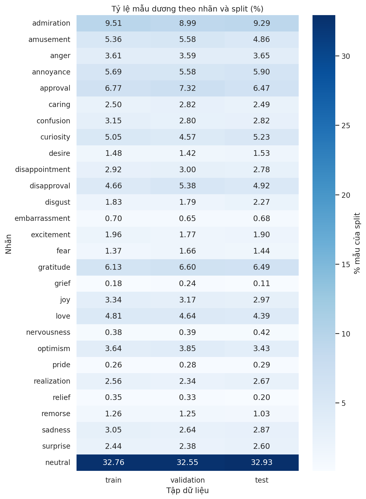
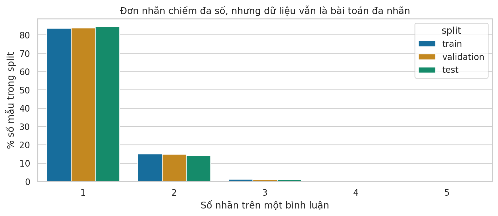
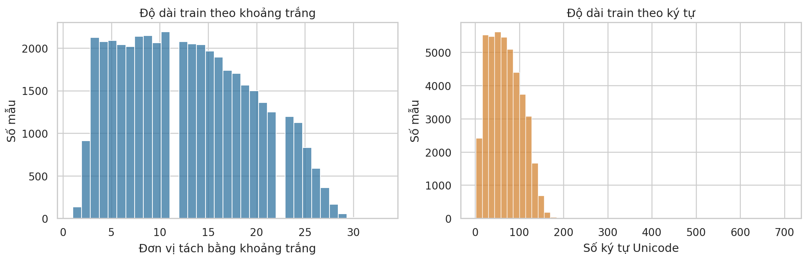
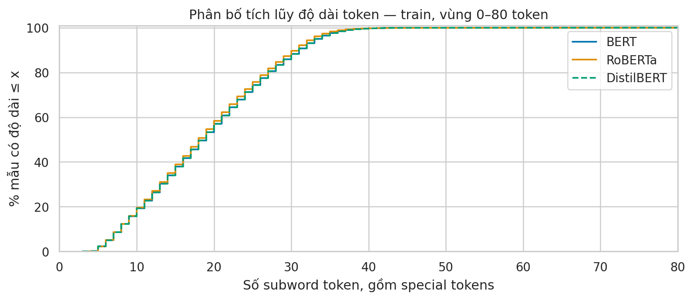

# Thống kê dữ liệu đã khám phá của đồ án GoEmotions

## 1. Phạm vi và nguồn dữ liệu

Phần thống kê phục vụ đề tài **Phân loại cảm xúc đa nhãn trên văn bản mạng xã hội với GoEmotions**. Sử dụng cấu hình simplified, bình luận tiếng Anh trên Reddit, 27 cảm xúc cùng neutral. Một bình luận có thể có nhiều nhãn. Ngôn ngữ thực hiện là Python; công cụ gồm pandas, NumPy, PyArrow, Matplotlib, Seaborn, Hugging Face Tokenizers và Jupyter. Chạy CPU, không cần GPU.

Revision được ghim: `add492243ff905527e67aeb8b80c082af02207c3`. Các số liệu dưới đây tính trực tiếp từ ba tệp Parquet và đã đối chiếu SHA-256 trong file kế hoạch. Phạm vi yêu cầu giảng viên được đọc qua `KE_HOACH_A_Z_DE_TAI_01_GOEMOTIONS.docx`; chưa truy cập trực tiếp được PDF SharePoint gốc.

Nguồn: [Google Research README](https://github.com/google-research/google-research/blob/master/goemotions/README.md), [dataset card](https://huggingface.co/datasets/google-research-datasets/go_emotions), [bài báo ACL 2020](https://aclanthology.org/2020.acl-main.372/). Không nhầm khoảng 58 nghìn bình luận của bộ gốc với 54.263 mẫu trong simplified.

## 2. Số mẫu và cấu trúc

| split      |   n_samples |   percent_all_samples |
|:-----------|------------:|----------------------:|
| train      |       43410 |               79.9993 |
| validation |        5426 |                9.9994 |
| test       |        5427 |               10.0013 |

Mỗi dòng có `id` (mã bình luận), `text` (nguyên văn) và `labels` (danh sách ID nhãn từ 0 đến 27). Giữ nguyên split chính thức. ID không trùng giữa các split; không có text thiếu hoặc rỗng, không có tập nhãn rỗng hoặc nhãn ngoài miền.

## 3. Phân bố nhãn và mất cân bằng

Support là số bình luận mang nhãn. Một dòng đa nhãn được tính vào nhiều nhãn; tổng support có thể lớn hơn số mẫu. Prevalence (%) = support / số mẫu của split × 100.

|   label_id | label          | dien_giai_vi     |   train_count |   validation_count |   test_count |   total_count |   train_prevalence_pct |
|-----------:|:---------------|:-----------------|--------------:|-------------------:|-------------:|--------------:|-----------------------:|
|          0 | admiration     | ngưỡng mộ        |          4130 |                488 |          504 |          5122 |                  9.514 |
|          1 | amusement      | thích thú        |          2328 |                303 |          264 |          2895 |                  5.363 |
|          2 | anger          | tức giận         |          1567 |                195 |          198 |          1960 |                  3.61  |
|          3 | annoyance      | khó chịu         |          2470 |                303 |          320 |          3093 |                  5.69  |
|          4 | approval       | tán thành        |          2939 |                397 |          351 |          3687 |                  6.77  |
|          5 | caring         | quan tâm         |          1087 |                153 |          135 |          1375 |                  2.504 |
|          6 | confusion      | bối rối          |          1368 |                152 |          153 |          1673 |                  3.151 |
|          7 | curiosity      | tò mò            |          2191 |                248 |          284 |          2723 |                  5.047 |
|          8 | desire         | mong muốn        |           641 |                 77 |           83 |           801 |                  1.477 |
|          9 | disappointment | thất vọng        |          1269 |                163 |          151 |          1583 |                  2.923 |
|         10 | disapproval    | không tán thành  |          2022 |                292 |          267 |          2581 |                  4.658 |
|         11 | disgust        | ghê tởm          |           793 |                 97 |          123 |          1013 |                  1.827 |
|         12 | embarrassment  | ngượng ngùng     |           303 |                 35 |           37 |           375 |                  0.698 |
|         13 | excitement     | hào hứng         |           853 |                 96 |          103 |          1052 |                  1.965 |
|         14 | fear           | sợ hãi           |           596 |                 90 |           78 |           764 |                  1.373 |
|         15 | gratitude      | biết ơn          |          2662 |                358 |          352 |          3372 |                  6.132 |
|         16 | grief          | đau buồn sâu sắc |            77 |                 13 |            6 |            96 |                  0.177 |
|         17 | joy            | vui vẻ           |          1452 |                172 |          161 |          1785 |                  3.345 |
|         18 | love           | yêu thương       |          2086 |                252 |          238 |          2576 |                  4.805 |
|         19 | nervousness    | lo lắng hồi hộp  |           164 |                 21 |           23 |           208 |                  0.378 |
|         20 | optimism       | lạc quan         |          1581 |                209 |          186 |          1976 |                  3.642 |
|         21 | pride          | tự hào           |           111 |                 15 |           16 |           142 |                  0.256 |
|         22 | realization    | nhận ra          |          1110 |                127 |          145 |          1382 |                  2.557 |
|         23 | relief         | nhẹ nhõm         |           153 |                 18 |           11 |           182 |                  0.352 |
|         24 | remorse        | hối hận          |           545 |                 68 |           56 |           669 |                  1.255 |
|         25 | sadness        | buồn bã          |          1326 |                143 |          156 |          1625 |                  3.055 |
|         26 | surprise       | ngạc nhiên       |          1060 |                129 |          141 |          1330 |                  2.442 |
|         27 | neutral        | trung tính       |         14219 |               1766 |         1787 |         17772 |                 32.755 |

Train có tỷ số support nhãn phổ biến nhất/hiếm nhất bằng **184.66 lần**; nếu chỉ xét 27 cảm xúc, tỷ số là **53.64 lần**. Năm nhãn hiếm chỉ xác định từ train để không dùng test định hướng thí nghiệm:

| label         |   train_count |   validation_count |   test_count |
|:--------------|--------------:|-------------------:|-------------:|
| grief         |            77 |                 13 |            6 |
| pride         |           111 |                 15 |           16 |
| relief        |           153 |                 18 |           11 |
| nervousness   |           164 |                 21 |           23 |
| embarrassment |           303 |                 35 |           37 |

Neutral phổ biến nhất nhưng không nên chỉ dự đoán neutral. Theo kế hoạch, báo Macro-F1 làm chỉ số chính, kèm Micro-F1 và F1/support từng nhãn; chú ý độ bất ổn ở nhãn hiếm.

## 4. Đặc tính đa nhãn

| split      |   n_samples |   label_assignments |   one_label |   two_labels |   three_or_more |   multi_label_samples |   multi_label_pct |   cardinality |   density |   max_labels |
|:-----------|------------:|--------------------:|------------:|-------------:|----------------:|----------------------:|------------------:|--------------:|----------:|-------------:|
| train      |       43410 |               51103 |       36308 |         6541 |             561 |                  7102 |           16.3603 |       1.17722 |   0.04204 |            5 |
| validation |        5426 |                6380 |        4548 |          809 |              69 |                   878 |           16.1813 |       1.17582 |   0.04199 |            4 |
| test       |        5427 |                6329 |        4590 |          774 |              63 |                   837 |           15.4229 |       1.16621 |   0.04165 |            4 |

Toàn bộ dữ liệu có **63,812 lượt gán nhãn**, **8,817 mẫu đa nhãn (16.25%)**, cardinality **1.1760** và density **0.04200**. Cardinality là số nhãn trung bình/mẫu; density là tỷ lệ ô 1 trong ma trận N × 28.

| split      |   neutral_total |   neutral_only |   neutral_with_other |   neutral_with_other_pct_all |
|:-----------|----------------:|---------------:|---------------------:|-----------------------------:|
| train      |           14219 |          12823 |                 1396 |                       3.2158 |
| validation |            1766 |           1592 |                  174 |                       3.2068 |
| test       |            1787 |           1606 |                  181 |                       3.3352 |

Neutral có thể cùng xuất hiện với cảm xúc khác. Giữ nguyên ground truth; không dùng softmax để ép các lớp loại trừ nhau trong bài toán này. Các cặp đồng xuất hiện nhiều nhất trên train:

| label_a        | label_b     |   count |   percent_train |   jaccard |
|:---------------|:------------|--------:|----------------:|----------:|
| admiration     | gratitude   |     279 |          0.6427 |    0.0428 |
| anger          | annoyance   |     269 |          0.6197 |    0.0714 |
| admiration     | approval    |     246 |          0.5667 |    0.0361 |
| confusion      | curiosity   |     212 |          0.4884 |    0.0633 |
| approval       | neutral     |     202 |          0.4653 |    0.0119 |
| admiration     | love        |     192 |          0.4423 |    0.0319 |
| annoyance      | disapproval |     178 |          0.41   |    0.0413 |
| disappointment | sadness     |     133 |          0.3064 |    0.054  |
| annoyance      | neutral     |     132 |          0.3041 |    0.008  |
| admiration     | joy         |     126 |          0.2903 |    0.0231 |

Jaccard = số mẫu cùng có hai nhãn / số mẫu có ít nhất một trong hai nhãn. Đồng xuất hiện là quan hệ thống kê, không khẳng định hai cảm xúc giống nghĩa hay có quan hệ nhân quả.

## 5. Chất lượng và trùng lặp

| split      |   n_samples |   missing_text |   missing_id |   blank_text |   empty_labels |   repeated_labels |   invalid_labels |   unique_ids |   unique_texts |   duplicate_id_extra_rows |   duplicate_text_extra_rows |
|:-----------|------------:|---------------:|-------------:|-------------:|---------------:|------------------:|-----------------:|-------------:|---------------:|--------------------------:|----------------------------:|
| train      |       43410 |              0 |            0 |            0 |              0 |                 0 |                0 |        43410 |          43227 |                         0 |                         183 |
| validation |        5426 |              0 |            0 |            0 |              0 |                 0 |                0 |         5426 |           5423 |                         0 |                           3 |
| test       |        5427 |              0 |            0 |            0 |              0 |                 0 |                0 |         5427 |           5421 |                         0 |                           6 |

| split      |   duplicate_text_groups |   rows_in_duplicate_groups |   duplicate_extra_rows |   duplicate_groups_with_different_labels |
|:-----------|------------------------:|---------------------------:|-----------------------:|-----------------------------------------:|
| train      |                     118 |                        301 |                    183 |                                       58 |
| validation |                       2 |                          5 |                      3 |                                        1 |
| test       |                       5 |                         11 |                      6 |                                        1 |

| left_split   | right_split   |   shared_ids |   shared_exact_texts |   left_rows_exact |   right_rows_exact |   shared_normalized_texts |   right_rows_normalized |
|:-------------|:--------------|-------------:|---------------------:|------------------:|-------------------:|--------------------------:|------------------------:|
| train        | validation    |            0 |                   41 |                84 |                 43 |                        46 |                      49 |
| train        | test          |            0 |                   32 |                79 |                 37 |                        37 |                      42 |
| validation   | test          |            0 |                   10 |                10 |                 13 |                        11 |                      14 |

Có 32 chuỗi trùng nguyên văn giữa train và test, ảnh hưởng 37 dòng test. Báo cáo benchmark chính giữ đủ 5.427 dòng test; phân tích độ nhạy dùng 5.390 dòng không trùng text với train. Danh sách này chưa loại các dòng trùng validation và không bảo đảm hết mọi dạng rò rỉ ngữ nghĩa. Phép chuẩn hóa nhẹ chỉ là chẩn đoán bổ sung. Không thể kết luận trùng người viết/cuộc hội thoại chỉ từ ba cột simplified.

## 6. Độ dài văn bản và tokenizer

| split      | measure            |   min |   mean |   std |   p50 |   p90 |    p95 |   p99 |   max |
|:-----------|:-------------------|------:|-------:|------:|------:|------:|-------:|------:|------:|
| train      | n_chars            |     2 |  68.4  | 36.72 |    65 |   120 | 131    |   151 |   703 |
| train      | n_words_whitespace |     1 |  12.84 |  6.7  |    12 |    22 |  24    |    27 |    33 |
| validation | n_chars            |     5 |  68.24 | 36.91 |    64 |   121 | 133    |   152 |   187 |
| validation | n_words_whitespace |     1 |  12.79 |  6.74 |    12 |    23 |  24.75 |    27 |    30 |
| test       | n_chars            |     5 |  67.82 | 36.32 |    65 |   119 | 132    |   148 |   184 |
| test       | n_words_whitespace |     1 |  12.73 |  6.67 |    12 |    22 |  24    |    27 |    32 |

Ký tự được đếm theo Unicode code points; từ ở bảng trên chỉ là đơn vị cách nhau bởi khoảng trắng. Hai thước đo này khác subword token của mô hình.

| tokenizer   | split      |   n_samples |   mean |   p50 |   p95 |   p99 |   max |
|:------------|:-----------|------------:|-------:|------:|------:|------:|------:|
| BERT        | train      |       43410 | 19.171 |    19 |    34 |    38 |   316 |
| BERT        | validation |        5426 | 19.123 |    19 |    34 |    38 |    48 |
| RoBERTa     | train      |       43410 | 18.91  |    18 |    33 |    37 |  1437 |
| RoBERTa     | validation |        5426 | 18.827 |    18 |    33 |    38 |    73 |
| DistilBERT  | train      |       43410 | 19.171 |    19 |    34 |    38 |   316 |
| DistilBERT  | validation |        5426 | 19.123 |    19 |    34 |    38 |    48 |

| tokenizer   | split      |   max_length |   samples_truncated |   percent_truncated |   tokens_removed |
|:------------|:-----------|-------------:|--------------------:|--------------------:|-----------------:|
| BERT        | train      |           64 |                   3 |             0.00691 |              321 |
| BERT        | train      |          128 |                   1 |             0.0023  |              188 |
| BERT        | train      |          256 |                   1 |             0.0023  |               60 |
| BERT        | validation |           64 |                   0 |             0       |                0 |
| BERT        | validation |          128 |                   0 |             0       |                0 |
| BERT        | validation |          256 |                   0 |             0       |                0 |
| RoBERTa     | train      |           64 |                  10 |             0.02304 |             1972 |
| RoBERTa     | train      |          128 |                   4 |             0.00921 |             1642 |
| RoBERTa     | train      |          256 |                   2 |             0.00461 |             1245 |
| RoBERTa     | validation |           64 |                   1 |             0.01843 |                9 |
| RoBERTa     | validation |          128 |                   0 |             0       |                0 |
| RoBERTa     | validation |          256 |                   0 |             0       |                0 |
| DistilBERT  | train      |           64 |                   3 |             0.00691 |              321 |
| DistilBERT  | train      |          128 |                   1 |             0.0023  |              188 |
| DistilBERT  | train      |          256 |                   1 |             0.0023  |               60 |
| DistilBERT  | validation |           64 |                   0 |             0       |                0 |
| DistilBERT  | validation |          128 |                   0 |             0       |                0 |
| DistilBERT  | validation |          256 |                   0 |             0       |                0 |

Token được đo bằng tokenizer.json chính thức, revision được lưu trong data/tokenizer_manifest.json. Đã gồm special tokens, không padding hay truncation khi đo, chỉ dùng train/validation. Mốc 128 là đề xuất thử nghiệm; số mẫu bị cắt không tự chứng minh tác động lên F1. Biểu đồ chỉ phóng vùng 0–80 token; bảng đã tính cả ngoại lệ dài. Các mẫu ngoại lệ và ID được lưu ở tables/tokenizer_outliers_train.csv. Giữ dấu câu, phủ định, emoji và text gốc; chốt max_length qua pilot trước khi đánh giá test.

## 7. Ví dụ dữ liệu

Bộ 30 ví dụ từ train được chọn để phủ đủ 28 nhãn, thêm trường hợp ≥3 nhãn và neutral đồng xuất hiện. ID không lặp, seed 42. Đây là mẫu minh họa có chủ đích; không dùng để ước lượng phân bố. Ghi chú đọc nội dung là diễn giải, không phải nhãn thay thế.

| id      | text                                                                                                                         | labels                     | reading_note                                                                                                                                                  |
|:--------|:-----------------------------------------------------------------------------------------------------------------------------|:---------------------------|:--------------------------------------------------------------------------------------------------------------------------------------------------------------|
| efajo6t | Lol alright dude. Nice chat.                                                                                                 | admiration                 | Cụm Nice chat có thể là lời khen hoặc lời kết mỉa mai tùy ngữ cảnh. Dữ liệu gán admiration; chỉ câu riêng lẻ chưa đủ xác nhận sắc thái.                       |
| eey5g23 | Why would [NAME] even care lol Reminds me of that [NAME] [NAME] I see a lot                                                  | amusement                  | Dấu hiệu lol gợi sắc thái thích thú. [NAME] là phần được che trong nguồn, không nên xóa hoặc đoán tên thật.                                                   |
| edko6gj | Screaming at this reply                                                                                                      | anger                      | Screaming là phản ứng mạnh nhưng cũng có thể chỉ cười hoặc bất ngờ trên mạng. Nhãn anger cần ngữ cảnh của reply để hiểu chắc hơn.                             |
| eeof8t8 | I just want to shake her by her shoulders and be like "*Why are you like this?!*"                                            | annoyance                  | Câu hỏi Why are you like this?! cùng ý muốn lay vai diễn tả bực bội, phù hợp cách đọc annoyance.                                                              |
| effjfum | Trolls are okay in this sub but let's be more serious here                                                                   | approval                   | Vế Trolls are okay thể hiện chấp nhận, trong khi vế sau yêu cầu nghiêm túc hơn. Cần đọc cả hai vế khi xem nhãn approval.                                      |
| eegojhf | [NAME] it’s ok the trumpet player can’t hurt you anymore                                                                     | caring                     | Cấu trúc it’s ok và can’t hurt you anymore là lời trấn an, gợi caring; vẫn có khả năng đùa tùy hội thoại.                                                     |
| efckxje | New to the area. I would think it's due to the cold. I havent seen my neighborhood this dark.                                | confusion                  | Người viết chưa quen khu vực và đang phỏng đoán nguyên nhân, tạo cảm giác chưa rõ tình hình; nhãn confusion không cần từ confused xuất hiện.                  |
| eelvbdz | Really? I was in New York last week and had to stand in the freezing cold to pump gas twice.                                 | curiosity                  | Really? mở đầu bằng phản ứng hỏi lại, nhưng câu cũng nêu trải nghiệm trái với thông tin trước. Curiosity cần phân biệt với surprise hoặc disapproval.         |
| edjsvk7 | I wish I could make a garden                                                                                                 | desire                     | I wish I could là dấu hiệu trực tiếp của mong muốn, giúp minh họa desire khá rõ.                                                                              |
| efdel1c | While out at the beach for a weekend for her birthday. There was no final straw, I just wanted to.                           | disappointment             | Câu bị tách khỏi câu chuyện trước đó, không có dấu hiệu disappointment rõ trong đoạn riêng. Giữ nhãn gốc và ghi nhận thiếu ngữ cảnh.                          |
| eeodxx6 | Good [NAME] she needs to stop                                                                                                | disapproval                | She needs to stop thể hiện phản đối hành động. Từ Good ở đầu không đủ để kết luận cảm xúc tích cực cho cả câu.                                                |
| efg2qtc | Everybody betrayed [NAME] [NAME]. I'm fed up with this world.                                                                | disgust                    | Fed up with this world diễn tả chán ghét; có thể gần anger hoặc disappointment. Dataset gán disgust, cho thấy ranh giới nhãn có thể gần nhau.                 |
| eewwxi9 | That awkward moment when people who passionately hate [NAME] inadvertently portray him as a hero.                            | embarrassment              | Awkward moment là dấu hiệu ngượng/ngại, nhưng câu nói về tình huống của người khác; cảm xúc trong văn bản không nhất thiết là trạng thái người viết.          |
| edtd2kd | Can't wait to see the corporate oligarchs that are *lucky* enough to *randomly* get picked.                                  | excitement                 | Can't wait gợi hào hứng, nhưng lucky và randomly được nhấn mạnh có thể tạo mỉa mai. Giữ excitement theo nguồn, không khẳng định cách đọc này là duy nhất.     |
| ef9hm8g | Imagine your daughter running away from home. I think that's a pretty terrifying idea without some murderer or mystic horror | fear                       | Terrifying diễn tả sự sợ hãi khá trực tiếp; câu nêu tình huống giả định, không phải thông tin xác nhận về đời sống người viết.                                |
| eev6c13 | Thank. Regardless, the fact that you can stay at 1mg kpins is fantastic                                                      | gratitude                  | Thank là dấu hiệu biết ơn; phần còn lại còn có lời khen fantastic. Nhãn gốc chỉ có gratitude, không tự bổ sung admiration.                                    |
| ef9u23n | He's eating cheese and watching football in the sky now. Rest in peace!                                                      | grief                      | In the sky và Rest in peace gợi tưởng nhớ người đã mất, minh họa grief; không đồng nhất mọi câu buồn với grief.                                               |
| ee14jqj | it’s what i would have wanted if i was a parent so yeah i’m glad i did something                                             | joy                        | I'm glad là dấu hiệu vui hoặc hài lòng, hỗ trợ nhãn joy.                                                                                                      |
| edosv4d | All good brother. Los Lonely Boys just came on and I'm jamming. Much love.                                                   | love                       | Much love là cách biểu đạt tình cảm trực tiếp, phù hợp nhãn love; không nhất thiết là tình yêu lãng mạn.                                                      |
| ef102f6 | I was told ignar was going to be awful by this sub.                                                                          | nervousness                | Câu kể lại đánh giá tiêu cực của người khác, không biểu lộ nervousness rõ. Đây là ví dụ cần hội thoại gốc hoặc xem lại quy trình gán nhãn.                    |
| efggot8 | Aw, man, with that title, I was hoping for good old-fashioned corporal punishment, like back in the 1700s.                   | optimism                   | Was hoping diễn tả kỳ vọng nhưng câu có thể mang sắc thái đùa tối hoặc thất vọng. Không nên coi từ hoping luôn đồng nghĩa với optimism.                       |
| ef42dka | Majority of [NAME] support Dem investigations of a foreign agent? I’m so proud!                                              | pride                      | I'm so proud là dấu hiệu trực tiếp cho pride; nội dung chính trị chỉ là ngữ cảnh của ví dụ nguồn.                                                             |
| ee8c7nd | Wow, again? You deleted and reposted it after I called you out not even 5 minutes ago! #desperate                            | realization                | Người viết nhận thấy hành động xóa và đăng lại. Dù có Wow và câu hỏi, dataset gán realization; dấu câu riêng lẻ không quyết định nhãn.                        |
| edzy275 | You sound like a douche.                                                                                                     | relief                     | Đoạn riêng lẻ giống lời chê hơn là biểu đạt nhẹ nhõm; không thấy dấu hiệu relief rõ. Đây là trường hợp mơ hồ hoặc nhãn đáng rà soát, không tự sửa nhãn chuẩn. |
| efarbiv | My bad, I guess I should've read the whole thing, from opiate yes                                                            | remorse                    | My bad và should've read thể hiện nhận lỗi, hỗ trợ nhãn remorse; giữ cách viết không chuẩn của bình luận.                                                     |
| eeaw4mw | This is so sad. [NAME], play 'bitch lasagna'                                                                                 | sadness                    | This is so sad gợi sadness, nhưng phần gọi phát bài hát có dạng meme. Cần phân biệt biểu đạt theo mẫu với cảm xúc theo nghĩa đen.                             |
| edglo8q | ### A surprise, to be sure, but a welcome one                                                                                | surprise                   | A surprise là dấu hiệu ngạc nhiên rõ; welcome one thêm sắc thái tích cực nhưng dữ liệu chỉ gán surprise.                                                      |
| ef4n82i | Where do you see that? There's a big red spot on the left side, not the right side.                                          | neutral                    | Câu hỏi và mô tả vị trí được gán neutral; không phải mọi câu hỏi đều mang curiosity trong nguồn.                                                              |
| eesesb6 | Somebody is really insecure about their career decisions.                                                                    | fear, nervousness, neutral | Insecure có thể gợi sợ hoặc lo lắng. Nhãn nguồn gồm fear, nervousness và neutral; minh họa ba nhãn cùng tồn tại, không coi neutral là loại trừ.               |
| efeuvbz | Bruh fox and heild look like the same dude                                                                                   | approval, neutral          | Câu so sánh ngoại hình được gán approval và neutral dù dấu hiệu tán thành không rõ trong câu riêng lẻ. Cần ngữ cảnh và giữ nguyên cả hai nhãn.                |

## 8. Kết luận đưa vào báo cáo tiến độ

Nhóm đã khảo sát 54,263 bình luận thuộc GoEmotions simplified với 28 nhãn. Dữ liệu gồm 43.410 mẫu train, 5.426 validation và 5.427 test; 16.25% bình luận mang từ hai nhãn trở lên. Phân bố nhãn mất cân bằng rõ rệt: neutral phổ biến nhất, trong khi grief, pride, relief, nervousness và embarrassment là năm nhãn hiếm nhất trên train. Bộ dữ liệu không có văn bản rỗng nhưng có text trùng trong và giữa các split. Nhóm giữ nguyên bộ chia chuẩn, bảo toàn nhãn neutral đồng xuất hiện và lưu thêm danh sách test không trùng text với train để phân tích độ nhạy khi đánh giá mô hình. Các thống kê độ dài theo tokenizer là cơ sở thử max_length trên train/validation. Các kết luận hiện tại chỉ mô tả dữ liệu, chưa phải kết quả huấn luyện hoặc chất lượng dự đoán.

## 9. Giới hạn và khả năng chạy lại

Reddit tiếng Anh không đại diện cho toàn bộ mạng xã hội hoặc tiếng Việt. Nhãn do con người gán có thể mơ hồ và phụ thuộc ngữ cảnh; simplified không cung cấp đủ thông tin annotator để tái tính mức đồng thuận. Kiểm tra trùng nguyên văn không phát hiện diễn đạt lại. EDA test chỉ dùng mô tả; không dùng để chọn mô hình/ngưỡng. Theo [README nguồn](https://github.com/google-research/google-research/blob/master/goemotions/README.md), dữ liệu còn chịu thiên lệch từ nguồn Reddit và quá trình gán nhãn.

Chạy `python scripts/run_eda.py` từ gốc repo sau khi cài requirements.txt. Notebook, bảng, hình, manifest và báo cáo được sinh lại; phiên bản môi trường nằm ở `reports/environment.json`, trạng thái đối chiếu ở `reports/verification.json`. Nhận xét nhóm nên lưu ở bản sao CSV để không bị ghi đè khi chạy lại.
