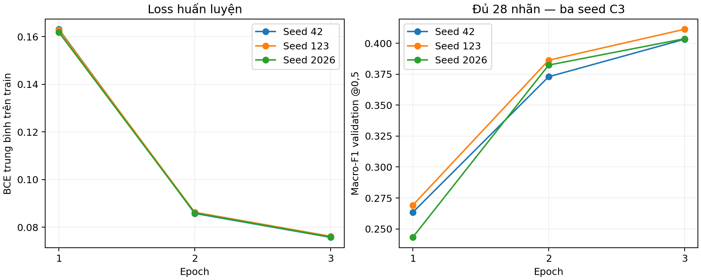
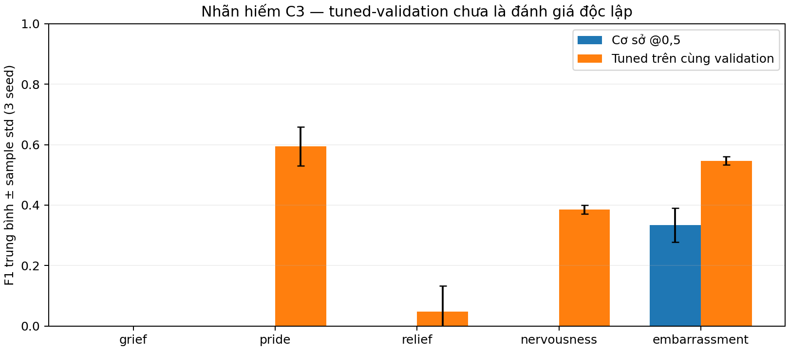

# Kết quả C3 DistilBERT — Nhật Huy

## Phạm vi thực tế

Đã fine-tune **3 seed [42, 123, 2026]**, mỗi seed 3 epoch, trên **43.410 train**;
đánh giá **5.426 validation** thật của GoEmotions simplified. Không tạo dữ liệu bổ sung,
không dùng test. Snapshot dữ liệu/model, cấu hình và quy tắc chọn kết quả được ghi trước
khi train trong [protocol.json](protocol.json). Các số dưới đây được chương trình đọc từ
artifact đã kiểm hash/ID/mapping và tính lại bằng metric chung của repo.

Đây là kết quả C3 trên validation. Chưa xác định kiến trúc thắng C1/C2/C3, chưa có kết quả
test cuối, chưa hoàn thành đối chiếu lỗi giữa ba kiến trúc. Huy có thể bàn giao phần độc lập này.

## Cấu hình và phương pháp

- Checkpoint `distilbert/distilbert-base-uncased`, revision `12040accade4e8a0f71eabdb258fecc2e7e948be`.
- Official split, 28 nhãn, multi-hot float32; tokenize tối đa 128 token, padding động.
- Fine-tune toàn bộ encoder và head 28 logits; BCEWithLogitsLoss, sigmoid khi suy luận.
- AdamW lr 2e-5, weight decay 0,01 (trừ bias/LayerNorm), warmup 10% rồi linear decay,
  clip gradient 1,0; batch vật lý/hiệu dụng 16, AMP, gradient checkpointing, CPU threads=4.
- Mỗi seed chọn epoch Macro-F1 validation @0,5 cao nhất, hòa giữ epoch sớm hơn.
- Metric đủ 28 nhãn, zero_division=0; std mẫu dùng ddof=1, n=3.
- GPU RTX 3050 Laptop 4 GB, PyTorch 2.11.0+cu128, Transformers 4.57.6.
- PyTorch cảnh báo một kernel attention backward không bảo đảm deterministic; seed và
  môi trường hỗ trợ tái lập, không bảo đảm mọi bit của lần train mới giống lần này.

DistilBERT là mô hình được tác giả tiền huấn luyện qua distillation từ BERT. Trong đồ án,
nhóm nạp checkpoint đã có và fine-tune cho 28 nhãn, không tự huấn luyện teacher hay tự
thực hiện distillation. Nguồn: [Sanh và cộng sự, 2019](https://arxiv.org/abs/1910.01108),
[model card](https://huggingface.co/distilbert/distilbert-base-uncased) (đọc 07/10/2026).

## Kết quả cơ sở từng seed

|   seed |   best_epoch |   macro_f1 |   micro_f1 |   macro_precision |   macro_recall |   micro_precision |   micro_recall |   hamming_loss |
|-------:|-------------:|-----------:|-----------:|------------------:|---------------:|------------------:|---------------:|---------------:|
|     42 |            3 |   0.403256 |   0.568935 |          0.572258 |       0.343198 |          0.709006 |       0.475078 |       0.030231 |
|    123 |            3 |   0.411325 |   0.576176 |          0.576251 |       0.351337 |          0.712373 |       0.483699 |       0.029883 |
|   2026 |            3 |   0.403670 |   0.573720 |          0.570269 |       0.344497 |          0.708266 |       0.482132 |       0.030087 |

## Trung bình và độ lệch chuẩn

| metric          | mean ± std          |   n |
|:----------------|:--------------------|----:|
| macro_f1        | 0.406084 ± 0.004544 |   3 |
| micro_f1        | 0.572944 ± 0.003683 |   3 |
| macro_precision | 0.572926 ± 0.003046 |   3 |
| macro_recall    | 0.346344 ± 0.004372 |   3 |
| micro_precision | 0.709882 ± 0.002189 |   3 |
| micro_recall    | 0.480303 ± 0.004592 |   3 |
| hamming_loss    | 0.030067 ± 0.000175 |   3 |

Không thay kết quả trung bình bằng seed tốt nhất. Seed **123** chỉ được chọn
làm checkpoint đại diện C3 để đọc lỗi và minh họa app theo quy tắc đã ghi trước.
Đây không phải kết luận DistilBERT là mô hình thắng toàn nhóm.

## Ngưỡng riêng từng nhãn — phần nâng cao C3

Mỗi checkpoint/seed chọn ngưỡng riêng từ scores validation của chính nó trên lưới
0,05..0,95, bước 0,05. Hòa F1 chọn ngưỡng gần 0,5 nhất, tiếp tục hòa chọn ngưỡng lớn hơn.
Lưu ngưỡng gắn hash checkpoint, scores, revision và mapping. Không lấy ngưỡng từ A/C1/C2.
Giữ nguyên trọng số đã train; đây là thay luật quyết định, không phải train thêm mô hình.

**Cảnh báo diễn giải:** ngưỡng vừa được chọn vừa được đo trên cùng validation nên số tuned
có thể lạc quan. Chưa thể kết luận mức cải thiện tương ứng trên test hoặc dữ liệu mới.
Hamming Loss càng thấp càng tốt; F1/P/R càng cao càng tốt, nên dấu delta cần đọc theo metric.

| metric          | cơ sở @0,5          | tuned trên cùng validation   |   delta trung bình |
|:----------------|:--------------------|:-----------------------------|-------------------:|
| macro_f1        | 0.406084 ± 0.004544 | 0.510645 ± 0.001230          |           0.104561 |
| micro_f1        | 0.572944 ± 0.003683 | 0.602453 ± 0.003956          |           0.029510 |
| macro_precision | 0.572926 ± 0.003046 | 0.524520 ± 0.018308          |          -0.048406 |
| macro_recall    | 0.346344 ± 0.004372 | 0.528732 ± 0.012407          |           0.182388 |
| micro_precision | 0.709882 ± 0.002189 | 0.552489 ± 0.006935          |          -0.157393 |
| micro_recall    | 0.480303 ± 0.004592 | 0.662435 ± 0.006282          |           0.182132 |
| hamming_loss    | 0.030067 ± 0.000175 | 0.036715 ± 0.000619          |           0.006648 |

Trên các run này, F1 và recall trung bình tăng sau tuning, nhưng micro precision giảm
và Hamming Loss tăng (xấu hơn). Cần báo cáo cả đánh đổi này, không kết luận mọi mặt đều cải thiện.

### Nhãn hiếm: đủ năm nhãn đã xác định từ train

| nhãn          |   train support |   val support | F1 cơ sở            | F1 tuned            |    delta |
|:--------------|----------------:|--------------:|:--------------------|:--------------------|---------:|
| grief         |              77 |            13 | 0.000000 ± 0.000000 | 0.000000 ± 0.000000 | 0.000000 |
| pride         |             111 |            15 | 0.000000 ± 0.000000 | 0.594517 ± 0.063819 | 0.594517 |
| relief        |             153 |            18 | 0.000000 ± 0.000000 | 0.048780 ± 0.084490 | 0.048780 |
| nervousness   |             164 |            21 | 0.000000 ± 0.000000 | 0.385569 ± 0.013978 | 0.385569 |
| embarrassment |             303 |            35 | 0.334511 ± 0.056319 | 0.546730 ± 0.014079 | 0.212220 |

Grief vẫn có F1 bằng 0 ở cả ba seed trước và sau tuning. Relief có mean F1 tuned thấp
và std lớn hơn mean; kết quả giữa các seed chưa ổn định. Không kết luận cả năm nhãn đều tăng.

Các bảng giữ đủ nhãn tăng, không tăng hoặc giảm. Chi tiết P/R/F1 từng nhãn và từng seed ở
[rare_labels_before_after.csv](rare_labels_before_after.csv); bảng đủ 28 nhãn ở
[per_label_all_seeds.csv](per_label_all_seeds.csv).

## Phân tích lỗi C3

Luật đếm dùng ngưỡng cơ sở 0,5:

- `FN_va_FP_cung_cau`: ít nhất một nhãn thật bị bỏ sót và ít nhất một nhãn thừa cùng câu.
  Đây là cặp lỗi dự đoán, không phải đồng xuất hiện nhãn và chưa tự chứng minh gần nghĩa.
- `thieu_mot_phan_nhan_that`: câu có ít nhất hai nhãn thật, nhận đúng ít nhất một nhãn nhưng bỏ sót nhãn khác.
- `sai_nhan_hiem_hoac_neutral`: FP hoặc FN thuộc một trong năm nhãn hiếm hoặc neutral.

|   seed | group                      |   n_samples |
|-------:|:---------------------------|------------:|
|     42 | FN_va_FP_cung_cau          |        1167 |
|     42 | thieu_mot_phan_nhan_that   |         458 |
|     42 | sai_nhan_hiem_hoac_neutral |        1255 |
|    123 | FN_va_FP_cung_cau          |        1168 |
|    123 | thieu_mot_phan_nhan_that   |         480 |
|    123 | sai_nhan_hiem_hoac_neutral |        1218 |
|   2026 | FN_va_FP_cung_cau          |        1184 |
|   2026 | thieu_mot_phan_nhan_that   |         463 |
|   2026 | sai_nhan_hiem_hoac_neutral |        1224 |

Nhóm lỗi có thể chồng lấn, không cộng các hàng để suy ra tổng câu sai. Ví dụ nguyên văn,
ID, true/pred, FN/FP và scores đủ 28 nhãn của seed đại diện nằm trong
[error_examples.json](error_examples.json), bản bảng [error_examples.csv](error_examples.csv).
Chọn tối đa 12 mẫu mỗi nhóm theo ID tăng dần, không tạo câu minh họa. Xem phần nhận xét
cụ thể trong [ERROR_ANALYSIS.md](ERROR_ANALYSIS.md).

## Chi phí và kiểm checkpoint

|   seed |   best_epoch |   fit_and_validation_seconds |   peak_cuda_allocated_mib |   skipped_amp_steps |   reload_max_abs_score_diff |
|-------:|-------------:|-----------------------------:|--------------------------:|--------------------:|----------------------------:|
|     42 |            3 |                     1411.581 |                  1363.135 |                   1 |                    0.000000 |
|    123 |            3 |                     1383.678 |                  1363.791 |                   1 |                    0.000000 |
|   2026 |            3 |                     1957.310 |                  1363.791 |                   1 |                    0.000000 |

Thời gian là train cộng validation của ba epoch, không gồm tải model hoặc kiểm reload cuối.
Nguồn điện/tải máy có thể thay đổi trong quá trình chạy; đây là nhật ký tài nguyên thực tế,
không phải benchmark tốc độ trong điều kiện được kiểm soát.
Không dùng những số này để khẳng định nhanh hơn C1/C2 khi chưa có phép đo cùng điều kiện.
Log thô ở `train_seed_42.log`, `train_seed_123.log`, `train_seed_2026.log`.
Số bước AMP bị bỏ qua được ghi trong bảng tài nguyên và từng `run_seed_*.json`; scheduler
chỉ tiến khi optimizer thực sự cập nhật. Một lượt seed 42 ban đầu dừng do xử lý AMP trước
khi hoàn tất; log được giữ ở [interrupted_fp16_gradcheck](../interrupted_fp16_gradcheck/README.md)
và **không** được tính vào bất kỳ bảng kết quả nào ở đây. Ba seed trên đều chạy từ đầu
bằng cùng bản mã sửa lỗi, không nối checkpoint của lượt dở dang.
Ngày 08/10/2026, một lượt seed 123 được phát hiện không còn tiến trình và log dừng trước
khi hoàn thành epoch 1, không có traceback xác định nguyên nhân. Log lưu ở
`train_seed_123_interrupted_20261008.log`; lượt đó cũng bị loại khỏi kết quả và seed 123
được chạy lại từ checkpoint gốc với cùng cấu hình/mã. Không suy đoán nguyên nhân gián đoạn.

## Bàn giao và phần còn phụ thuộc nhóm

- Code C3, config, notebook đã chạy, bảng số thật, ngưỡng, lỗi và báo cáo: sẵn sàng bàn giao.
- Checkpoint/tokenizer/scores: `data/processed/c3_distilbert/full/seed_<seed>/`, nằm cục bộ,
  không đưa file model lớn lên Git. Model dùng safetensors; nguồn code của mỗi run được lưu ở `source/`.
- App minh họa C3 dùng seed đại diện, hỗ trợ ngưỡng cơ sở và ngưỡng riêng đúng run; không
  ghi đây là demo best C của nhóm. Kiểm app/CLI và input biên ở [verification.json](verification.json).
- Cần C1/C2 để so kiến trúc, đối chiếu ít nhất ba nhóm lỗi cùng ID và chọn demo cuối.
- Cần nhóm khóa danh sách mô hình/cấu hình/ngưỡng và protocol trước đánh giá test cuối.

Hướng dẫn: [HUY_DISTILBERT.md](../../../docs/HUY_DISTILBERT.md).
Notebook: [distilbert_huy.ipynb](../../../notebooks/distilbert_huy.ipynb).
